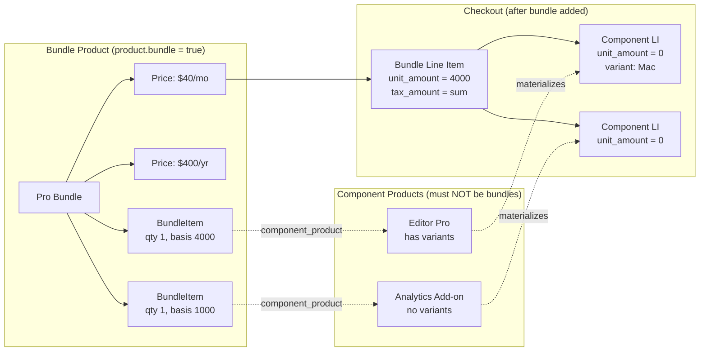
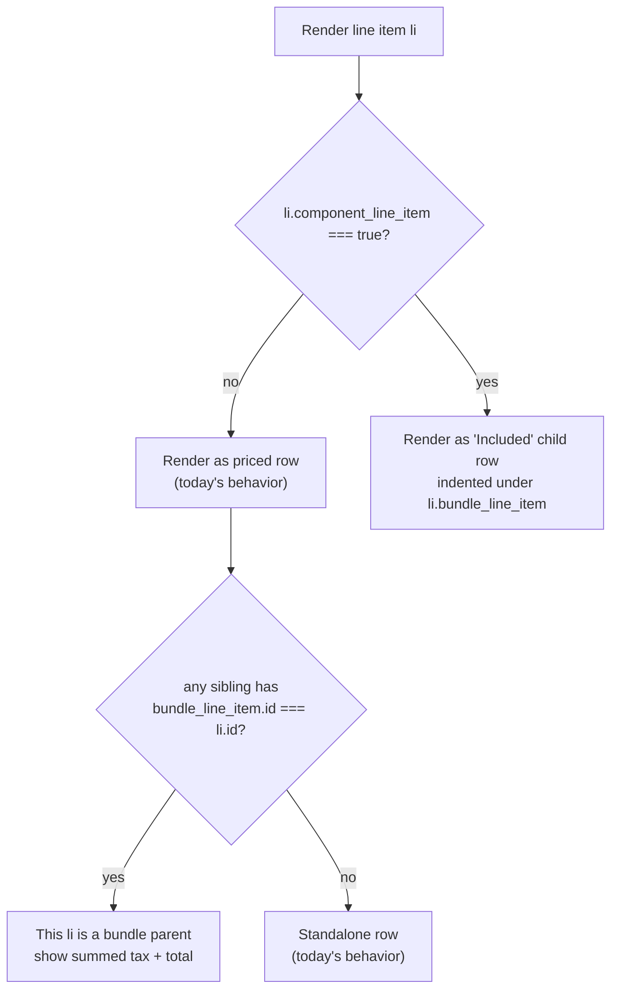
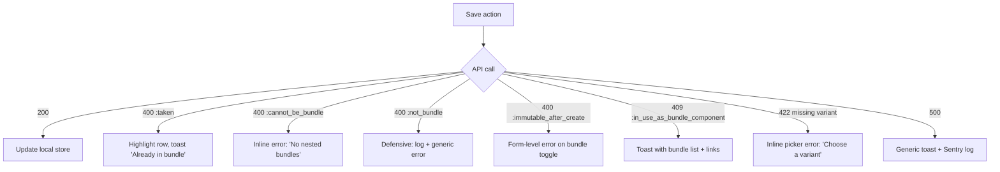

# Product Bundles — Plugin Frontend Plan

**Status:** Plan, not yet implemented. Built against the refactored platform API (bundle moved from `Price` → `Product`).
**Scope:** Merchant dashboard, storefront product detail, checkout UI, customer account purchases.
**Back-compat stance:** Purely additive. No feature flag, no migration. Existing sites are untouched until a merchant explicitly creates a bundle.
**Linear:** SPLAT-1748
**Owner of API contract:** Platform team. **Owner of this plan:** Plugin frontend team.

> Read this top-to-bottom before opening a PR. The phase order is load-bearing — Phase 1 unlocks Phase 2, etc. Skipping ahead means re-doing work.

---

## 1. Why bundles, and why this shape

A bundle is a parent `Product` that, when purchased, entitles the customer to a fixed set of component `Product`s. The customer experiences one priced row; the platform internally materializes the components so we can grant per-component entitlements, tax components separately, and invoke/revoke each one on subscription renewals.

The platform refactor moved `bundle: true` from the `Price` to the `Product`. That single change propagates everywhere:

- A bundle product can have any pricing shape (one-time, recurring, trial, setup fee, ad-hoc, mixed intervals). All previous price-level constraints are gone.
- Components are picked at the **product** level. The shopper picks variants at checkout, not the merchant in admin.
- The bundle line item keeps its real `unit_amount`. Component line items are `unit_amount: 0` and render as "Included" — never as `$0.00`.

We are a thin client over this. The platform owns validation, allocation, sync, and entitlement cascading. The plugin's job is rendering and merchant CRUD against the documented contract.

---

## 2. Mental model



Two terms we will use throughout this document:

- **Bundle line item** — parent. `component_line_item: false`, `bundle_line_item: null`. Has the real price. Quantity controls live here.
- **Component line item** — child. `component_line_item: true`, `bundle_line_item: { id: "li_parent" }`. Always `unit_amount: 0`, `tax_amount: 0`. Read-only from the UI's perspective.

---

## 3. What we are building (and what we are not)

### Building

1. A `BundleItem` PHP model and a REST proxy at `/wp-json/surecart/v1/bundle_items`.
2. A `bundle: true` toggle on the **product create** form (and only there). Hidden on edit.
3. A "Components" panel on the bundle product edit screen — reorderable list, product picker, per-row qty + optional basis amount.
4. A storefront "Included in this bundle" section on the product detail page (next-gen block) with per-component variant pickers and a gated Add-to-cart.
5. Cart and checkout rendering that groups bundle parent + components, displays "Included" rows, consolidates tax, and routes quantity/remove actions to the parent only.
6. Customer account purchases view that renders per-component entitlements for bundle purchases (downloads, licenses, fulfillments).
7. Subscription renewal handling — components are auto-re-materialized server-side; we just need to render correctly.
8. TypeScript types in `@surecart/api-fetch` (or wherever shared types live) for `BundleItem` and the new `LineItem` fields.

### Not building (and why)

- **A "Bundle" post type or anything in the WP database.** Bundle products are still products. Same `Product` model, same admin route, same PSR-4 path. Adding a parallel post type would duplicate everything.
- **Server-side validation logic.** All rules (no nested bundles, uniqueness of component per bundle, etc.) come back from the API as `WP_Error`. We translate via the existing `ErrorsTranslationService` lookup files.
- **A separate bundle pricing form.** Bundle products use the standard pricing tab. No new UI.
- **Component-scoped coupons.** The platform doc lists this as a known limitation (components are $0, nothing to discount). We will not promise this in the merchant UI.
- **Variant pickers in the merchant components editor.** Variant choice is the shopper's, at checkout. The merchant only picks the component product.
- **A "convert product to bundle" action.** `bundle` is immutable after create. We document this clearly and link to a "Create new bundle" CTA from the product list page.
- **Legacy block updates.** All bundle-aware UI is built in `packages/blocks-next`. The legacy `packages/blocks/Blocks/` system is maintenance-only (per `packages/CLAUDE.md`).

---

## 4. Backwards compatibility — what existing sites need to know

Existing sites are unaffected unless a merchant creates a bundle. The contract:

| Concern | Existing behavior | New behavior | Risk |
|---|---|---|---|
| Existing products | `product.bundle` is missing or `false` | API returns `bundle: false` for all old products | None — additive field |
| Existing line items | No `component_line_item` field | Now always `component_line_item: false`, `bundle_line_item: null` | None — additive fields, defaults are correct |
| Existing cart/checkout rendering | Renders flat list | Branches on `component_line_item` — non-bundle carts hit the same code path | Verify no UI shifts on a 0-bundle store |
| Existing product edit screen | No "bundle" toggle | Toggle hidden on edit; only visible on create | None |
| Existing webhooks/hooks | Same `surecart/purchase_*` actions | Bundle purchases fire one parent `purchase_created`, plus N component `purchase_created` actions | **Audit:** integrations that rely on a 1:1 mapping between checkout and purchase will fire N+1 times for bundles. Document in release notes; add filter if requested |
| Existing third-party integrations | Map purchase → external system | A bundle parent purchase plus N component purchases all fire | Same audit as above |

**Rendering decision rule (the load-bearing branch):**



Stores with zero bundles always take path C → G. The new code paths are dead-code on those stores.

---

## 5. The shape we build against (concise contract)

This is the abridged version. The platform doc is the source of truth; if anything in this section conflicts with `surecart.mintlify.app/api-reference/bundle-items/*`, the API wins.

### Product additions
- New attribute `bundle: boolean` (default `false`, **immutable after create**, error code `:immutable_after_create`).
- New nested attribute on create: `bundle_items: [{ component_product, quantity, basis_amount, position }]`.
- New expansion: `bundle_items` with nested `component_product` expansion.

### BundleItem
- `GET/POST/PATCH/DELETE /v1/bundle_items` and `GET /v1/bundle_items/:id`.
- Filters: `bundle_product_ids[]`, `component_product_ids[]`, `ids[]`.
- Fields: `id`, `bundle_product`, `component_product`, `quantity` (int > 0), `basis_amount` (int cents, nullable, ≥ 0), `position`, `metadata`, `current_version`, `created_at`, `updated_at`.
- Validation errors we surface in UI: `:not_bundle`, `:cannot_be_bundle`, `:taken`, `:account_mismatch`, `:in_use_as_bundle_component` (on component product discard).

### LineItem additions
- `component_line_item: boolean`.
- `bundle_line_item: LineItem | null` (expansion).
- `bundle_component_variants: { [component_product_id]: variant_id }` (only set on the bundle line item).
- Component LIs always have `unit_amount: 0`, `tax_amount: 0`, but `tax_rate` is populated for audit.

### Hidden bundle-component prices
- The platform lazily creates `$0` "bundle component prices" per component+currency. These are **filtered out** of `GET /v1/prices` and return 404 on direct retrieve. We do not need to filter or detect them. Never link to them.

### Checkout interaction
- **Add a bundle:** `POST /v1/checkouts/:id/line_items` with `price_id` of the bundle's price + `bundle_component_variants` map.
- **Update a bundle:** `PATCH` the bundle line item. Components re-sync server-side.
- **Remove a bundle:** `DELETE` the bundle line item. Children cascade.
- **Never PATCH/DELETE a component line item directly.** UI must reroute or block.

---

## 6. Phased delivery (the build order)

```mermaid
gantt
  title Bundle frontend build order
  dateFormat  X
  axisFormat %s
  section Foundation
  P1 Types + Model + REST proxy        :p1, 0, 5
  section Read-path
  P2 Cart/checkout rendering           :p2, after p1, 6
  section Buy-path
  P3 Storefront product detail block   :p3, after p2, 6
  section Author-path
  P4 Merchant create + components UI   :p4, after p1, 8
  section Owner-path
  P5 Customer account & renewals       :p5, after p2, 4
  section Hardening
  P6 Polish, edges, telemetry, docs    :p6, after p3, 5
```



The dependency graph is: P1 unlocks all others. P4 (merchant authoring) can run in parallel with P2/P3 because it doesn't depend on rendering. P3 (storefront buy) requires P2 (cart rendering) to be useful end-to-end. P5 requires P2.

---

## 7. Phase 1 — Foundation: model, REST, types

**Goal:** A working `BundleItem` CRUD path through the plugin, plus shared types. Nothing user-visible.

### 7.1 PHP — `BundleItem` model

Mirror the existing `Model` pattern (see `app/CLAUDE.md`):

- Path: `app/src/Models/BundleItem.php`
- Extends `Model` (API-backed, not `DatabaseModel`)
- `$endpoint = 'bundle_items'`, `$object_name = 'bundle_item'`
- Add a `HasComponentProduct` trait or a `setComponentProductAttribute` setter that hydrates an expanded `Product` into a relation, mirroring how `LineItem::setVariantAttribute` works
- Add a `setBundleProductAttribute` setter likewise

### 7.2 PHP — REST controller + service provider

Three-file pattern (per `app/CLAUDE.md`):

- `app/src/Controllers/Rest/BundleItemsController.php` extending `RestController`, `protected $class = BundleItem::class`
- `app/src/Rest/BundleItemsRestServiceProvider.php` with `$endpoint = 'bundle_items'`, full method set
- Register in `app/config.php` under `'providers'`
- Permission callbacks: `current_user_can('edit_sc_products')` — bundle items are an extension of products, no separate capability

### 7.3 PHP — Product model: expose `bundle` + nested attributes

- Verify the `Product` model's mass-assignment / fillable list accepts `bundle` and `bundle_items` (it likely does via the model's generic attribute fill, but confirm)
- Add a small `isBundle()` helper on the Product model for readability in templates and view files

### 7.4 PHP — translate validation errors

Add to `app/src/Support/Errors/` lookup files:

| API error code | User-facing message |
|---|---|
| `:not_bundle` | "Components can only be added to bundle products." (should be unreachable from the UI) |
| `:cannot_be_bundle` | "You can't nest bundles. Pick a non-bundle product as a component." |
| `:taken` | "This product is already in the bundle. Increase its quantity instead." |
| `:in_use_as_bundle_component` | "This product is included in {n} bundle(s): {list}. Remove it from those bundles before archiving." |
| `:immutable_after_create` | "A product's bundle setting can't be changed after creation. Create a new bundle product instead." |

### 7.5 TypeScript types

- Path: typically alongside other shared types — confirm with `@surecart/api-fetch` usage
- Export `BundleItem`, augment `Product` with `bundle: boolean` and `bundle_items?: BundleItem[]`, augment `LineItem` with `component_line_item`, `bundle_line_item`, `bundle_component_variants`

### 7.6 Phase 1 exit criteria

- `BundleItem::all()`, `find()`, `create()`, `update()`, `destroy()` work end-to-end against the live API
- A unit test under `.dev/tests/php/unit/Models/BundleItemTest.php` covers create/update/destroy + the validation error translation
- Types pass `tsc --noEmit` across the workspace

---

## 8. Phase 2 — Cart & checkout rendering

**Goal:** When a checkout response contains bundle line items, the UI renders parent + indented children correctly. Existing carts unchanged.

### 8.1 Where the changes live

- **Stencil cart line items:** `packages/components/src/components/controllers/checkout/sc-line-item*` (existing). One single component should branch on `component_line_item`.
- **Cart drawer:** the same components are reused. No separate logic.
- **Checkout summary / order summary:** ditto.

### 8.2 Rendering rules (the spec)

Use this exact grouping logic in one place — a `useGroupedLineItems` hook (or equivalent Stencil store selector):

```
INPUT: line_items[] (with bundle_line_item expanded)
PROCESS:
  parents = line_items.filter(li => !li.component_line_item && !isBundleChild(li))
  childrenByParentId = groupBy(line_items.filter(li => li.component_line_item), li => li.bundle_line_item.id)
OUTPUT: parents.map(p => ({ parent: p, children: childrenByParentId[p.id] ?? [] }))
```

Then rendering becomes a flat `for parent { render parent; for child in children { render child } }`. **Do not** sprinkle `component_line_item` checks across multiple components.

### 8.3 Visual spec (Shopify-pattern)

Following Shopify's bundle cart pattern (parent priced, children indented and de-emphasized):

```
[ image ]  Pro Bundle — Monthly                      $40.00
                                                     [ qty −  1  + ]   [ ✕ ]
           ↳ Editor Pro · Mac                        Included
           ↳ Analytics Add-on                        Included

           Tax (5.2% weighted)                        $2.08
           Subtotal                                  $40.00
           Tax                                        $2.08
           Total                                     $42.08
```

Concrete rules:

| Element | Behavior |
|---|---|
| Parent row amount | Use `subtotal_amount`, `total_amount` as today |
| Child row amount | Render literal "Included" copy. Never `$0.00` |
| Child row variant | Show the chosen variant name next to the component name |
| Quantity stepper | Only on the parent row |
| Remove button | Only on the parent row. Removing it cascades server-side; we don't need a confirm dialog beyond the existing one |
| Tax line | Single line on the parent's bundle row using `bundle.tax_amount` |
| Discount | Discounts apply to the parent. Don't try to allocate to children |
| Per-component tax rate | Optional disclosure (tooltip / expandable) using `child.tax_rate` for transparency |

### 8.4 Action gating (defensive)

The cart UI should **never** issue:

- `PATCH .../line_items/:id` against a `component_line_item` — reroute to parent
- `DELETE .../line_items/:id` against a `component_line_item` — block (component composition is merchant-defined)
- A quantity stepper on a child — don't render it

A small helper `isBundleChild(li): boolean` should be used everywhere a quantity, remove, or update action is wired.

### 8.5 Tax-inclusive pricing

`total_amount` already reconciles. Don't special-case. (Per platform doc §9.)

### 8.6 Phase 2 exit criteria

- Manual test: a non-bundle store renders identically before/after (visual diff)
- Manual test: a checkout with one bundle + variants displays parent + 2 children correctly
- Manual test: changing parent quantity from 1 → 2 doubles the children's display quantity (derived from `bundle_item.quantity × bundle_line_item.quantity`)
- Manual test: removing the parent removes children from the cart
- Manual test: tax-inclusive store totals reconcile to `total_amount`
- E2E test added: bundle in cart, finalize, view as confirmed order

---

## 9. Phase 3 — Storefront product detail (Add to cart)

**Goal:** A shopper visiting a bundle product page sees what's included, picks variants for components that have them, and adds the bundle to cart with `bundle_component_variants` populated correctly.

### 9.1 Where the changes live

One new next-gen block (per `packages/CLAUDE.md`, all new blocks go to `blocks-next`). The component variant pickers inside it are not separate blocks — they reuse the existing `sc-variant-picker` Stencil component directly, so the picker UI stays identical to the rest of the storefront.

```
packages/blocks-next/src/blocks/product-bundle-included/
├── block.json        # name: surecart/product-bundle-included, supports.interactivity: true
├── controller.php    # reads sc_get_product(), early-return if !product->bundle or empty bundle_items
├── view.php          # renders the "What's included" list, with sc-variant-picker per component that has variants
├── edit.js           # block editor preview
└── style.scss
```

The block lives below the standard product hero in the bundle product template. Merchants editing the bundle product's page template see this block automatically inserted (by the bundle product template / pattern) and can reorder it like any other block.

### 9.2 UX — picking the right pattern

A bundle product page is a configurator in disguise. The merchant's mental model is "this is just a product page" but the shopper has decisions to make per component. The wrong UX makes a bundle PDP feel alien next to a normal product PDP. The right UX makes it feel like the same page with one extra section.

There are three plausible patterns. We compared them; **option B is the recommended pattern**:

#### Option A — Per-component cards

Each component is a card with its own thumbnail, name, and variant pickers inline as a self-contained block.

**Pros:** Clear scoping, scales to many components, hard to mis-interpret.
**Cons:** Card chrome makes the PDP feel like a "configurator" rather than a product page. Visually heavy for simple bundles. Different from how a non-bundle PDP looks.

#### Option B — Grouped sections (RECOMMENDED)

Components are listed in a single "What's included" section. Components without variants are simple list rows. Components with variants get their variant pickers underneath the component name, styled with the **same `sc-variant-picker` UI we already use on non-bundle product pages**. No card chrome — just a small label and the picker(s).

**Pros:** Reuses the existing variant-picker UI, so the page feels like a normal PDP with one extra section. Scoping is preserved (variants live under their component's name). Scales gracefully — components without variants just don't render a picker. Matches the API shape (`bundle_component_variants` keyed by `component_product_id`).
**Cons:** A bundle with many variant-heavy components is still vertically tall. (Acceptable — it should be.)

#### Option C — Fully flattened variant pickers

Aggregate all components' variants into a single variant area at the top of the PDP, styled like a normal product's variants. Each picker is prefixed with the component name to disambiguate (e.g. "Editor Pro / Size", "Analytics / License").

**Pros:** Maximum visual familiarity with a non-bundle PDP.
**Cons (why we rejected it):**
1. **Option-name collisions.** If two components both have a "Size" option, you can't render one shared picker. You're forced to prefix names with the component, which is exactly what Option B does — only with worse styling and no grouping.
2. **Lost scoping.** Submitting `bundle_component_variants` requires knowing which component each selected variant belongs to. Scattering pickers in a flat area without grouping makes the mapping invisible to the shopper and harder to debug.
3. **Components without variants disappear.** They contribute no pickers, so they vanish from the variant area entirely — but they're still part of the bundle, so we'd need a separate "what's included" list anyway. We end up shipping both Option C *and* Option B's content area, doubling the surface.
4. **Doesn't scale** beyond 2–3 components.

> **Note on Shopify:** Shopify's official Bundles app fixes the variant per component at *merchant* time, so the PDP shows component variants as fixed labels (e.g. "T-Shirt · Size M"), not pickers. SureCart's refactored model puts variant choice on the shopper, so we're closer to Shopify's customizable-bundle apps (Bundler, Smart Bundles) — which uniformly use the per-component grouped-section pattern (Option B). The "flat variants" pattern is rare in production bundle UIs because of the trade-offs above.

#### Recommended layout (Option B)

```
[ Bundle product hero — image, title, description, price, Add to cart button ]

What's included

▸ Editor Pro
    Style    ( ) Mac    ( ) Windows
    Color    [ Slate ▾ ]

▸ Analytics Add-on
    License  [ Standard ▾ ]

▸ Onboarding Call
    (no variants — just listed)

[ Add bundle to cart — $40/mo ]   ← disabled until every variant-having component has a selection
```

Concrete rules:

- The "What's included" section sits **below** the standard product hero, not replacing it. The hero (image, title, description, price, Add-to-cart) is the same blocks the merchant uses on any product page.
- Each component renders as a row: thumbnail (small, optional), component name, then any variant pickers underneath using the existing `sc-variant-picker` styling.
- A component without variants renders just the name (and optionally "Qty 1 included" if `bundle_item.quantity > 1`).
- The Add-to-cart button is the same `sc-product-buy-button` the rest of the storefront uses. It's gated `disabled` until every variant-having component has a selection. Validation messages render inline with the picker, not as a top-of-page error.
- If the bundle product has **its own** variants too (the API doesn't forbid this), they render in the normal product hero variant area, exactly as today. The "What's included" section is purely for component-product variants. The two areas don't interact in the UI — they map to different pieces of the request body (top = the bundle's own variant; included = `bundle_component_variants`).
- If `product.bundle_items` is empty, **don't render the section at all**. Don't show "What's included" with no items.

### 9.3 Add-to-cart wiring

The existing `sc-product-buy-button` flow is reused. The only addition is a payload override hook:

- A Stencil controller (could be `sc-bundle-buy-controller` or a slot inside the product context) that:
  1. On mount, reads `product.bundle_items` (with `component_product` expanded, including its variants) from product context
  2. Holds local state: `selections: Record<componentProductId, variantId>`
  3. Computes `isReady = bundle_items.every(bi => !hasVariants(bi.component_product) || selections[bi.component_product.id])`
  4. Disables the buy button while `!isReady` and shows inline picker errors after attempted submit
  5. When `Add to cart` fires, the line-item POST body includes `bundle_component_variants: selections`

### 9.4 Editing a selection from the cart

A shopper who already added the bundle and wants to swap a variant:

- Click the variant name in the cart child row → opens an inline picker (small popover)
- On change → `PATCH .../line_items/:bundle_li_id` with the new `bundle_component_variants`
- The component children re-sync server-side; the cart re-fetches

This is a P3.5 nice-to-have, not blocking. The acceptable v1 UX is: "remove the bundle and re-add it from the product page".

### 9.5 Component preloading

Per `app/CLAUDE.md`, any new next-gen block using Stencil components must be added to `app/config.php` under `'preload'`. The included block reuses `sc-variant-picker`, so it must preload it (otherwise the first picker render causes a visible layout shift):

```
'surecart/product-bundle-included' => ['sc-variant-picker', 'sc-product-buy-button', ...]
```

If a bundle-specific row/header Stencil component is introduced later (e.g. `sc-bundle-component-row`), add it to this list. v1 should avoid creating new Stencil components — compose from existing primitives.

### 9.6 Phase 3 exit criteria

- Block renders nothing for non-bundle products (early return in controller.php)
- Add-to-cart is disabled until all required variants are selected
- Validation: omitting a required component variant returns a server validation error which the UI surfaces inline (matches platform doc §6 "If a component product has variants but you omit its selection")
- E2E test: visit a bundle product page → select variants → add to cart → verify cart shape

---

## 10. Phase 4 — Merchant dashboard (authoring)

**Goal:** Merchants can create a bundle product and manage its components.

### 10.1 Two separate UI moves

- **Create flow:** add a `bundle: true` toggle. **Only on create.** Hidden on edit.
- **Edit flow:** add a "Components" tab/panel on the bundle product edit screen.

### 10.2 Product list — entry points

Today there's a single "Add product" CTA. Following Shopify's split CTA pattern (a primary button with a chevron menu), we offer:

```
[ Add product ▾ ]
   ├── Add product
   └── Add bundle    ← opens product create with bundle: true pre-selected
```

The toggle still exists on the standard create form; the menu is just convenience. Both paths land on the same form; the `bundle` checkbox is the source of truth.

### 10.3 Create form — the toggle

A single section, near the top of the create form:

```
☐  This is a bundle
    A bundle lets customers buy multiple products for one price. You won't be able to change this later.
```

When toggled on:

- (Optional polish) Hide the "Pricing" tab from the wizard until basic details are saved — no, on reflection, do not hide it. Bundle products price normally. Keep it visible.
- Submit goes to the same `POST /v1/products` endpoint, with `bundle: true`. No separate route.
- Disable the toggle once the form has been submitted/saved (it's immutable after create).

### 10.4 Edit form — the Components panel

Only visible when `product.bundle === true`. New tab in the product edit screen, sibling to "Pricing", "Variants", etc.

```
Components

Customers buying this bundle will get all of the products listed below.

┌─ ⋮⋮ [img] Editor Pro              Qty [ 1 ]  Basis amount [        ]   [ ✕ ] ─┐
├─ ⋮⋮ [img] Analytics Add-on        Qty [ 1 ]  Basis amount [        ]   [ ✕ ] ─┤
└─────────────────────────────────────────────────────────────────────────────────┘

[ + Add component ]
```

Per row:
- Drag handle (reorders → updates `position` via PATCH on each affected item)
- Product thumbnail + name (linked to the component product's edit page in a new tab)
- Quantity input (integer, min 1)
- Basis amount input (cents, optional). Show currency-aware formatting. Show a subtle helper row underneath: "Optional. Used to weight tax allocation across components."
- Delete (✕) — soft confirm only on the last item ("Removing this leaves the bundle without components.")

The `Add component` button opens a product picker modal:
- Reuses the existing product picker component if there is one. Otherwise, wraps the existing products list endpoint with a search box.
- **Filters applied at the API level (not just client-side):** `bundle: false` (exclude bundle products), and exclude `id = current_bundle_product_id` (no self-reference).
- Optional polish: also exclude already-added components (uniqueness will reject anyway, but excluding makes the picker cleaner).

### 10.5 Mixed-basis warning

When any component has `basis_amount` set and another doesn't, render an inline warning on the rows that are nil:

```
⚠ This component will be allocated $0 for tax. Set a basis amount to include it in the split.
```

(Per platform doc §4.)

### 10.6 Validation surfacing

| Error from API | UI behavior |
|---|---|
| `:taken` | Highlight the offending row in the picker. Toast: "Already in this bundle." |
| `:cannot_be_bundle` | Should not be reachable (we filter the picker). Defensive: show inline. |
| `:not_bundle` | Should not be reachable. Defensive log to console + generic toast. |
| `:in_use_as_bundle_component` (on component archive elsewhere) | Toast on the component product's archive screen, listing bundle names. Provide quick links. |

### 10.7 Variants — explicitly NOT here

The components editor must not show variant selection. Hide `sc-variant-picker` entirely on this screen if it's auto-rendered anywhere. Variant choice belongs to the shopper at checkout (per platform doc §3, §6).

### 10.8 Save semantics

Two acceptable patterns. Pick one and document it on the team channel:

- **Pattern A — Inline save per row.** Each edit (add, remove, qty change, basis change, reorder) issues an individual PATCH/POST/DELETE/reorder. Pros: no save button, lower cognitive load. Cons: noisier network.
- **Pattern B — Pending edits + Save bar.** Edits stage locally; a sticky save bar commits via the nested `bundle_items` attribute on the parent product PATCH. Pros: single transaction, undo affordance. Cons: more state to manage.

**Recommendation:** Pattern A. It matches how the product variants editor likely already behaves, and the API supports per-row CRUD natively. Pattern B can be added later if user research demands it.

### 10.9 Phase 4 exit criteria

- A new bundle product can be created in one form submission, with components attached
- Components panel supports add, remove, reorder, quantity edit, basis edit
- All API errors translate to actionable UI messages
- Visual regression: non-bundle products show no components panel, no toggle on edit
- E2E test: create bundle → add 2 components → verify shape via API

---

## 11. Phase 5 — Customer account & renewals

**Goal:** A customer who has bought a bundle sees per-component entitlements (downloads, license keys, fulfillment status) on their account/purchases page. Subscription renewals re-materialize cleanly.

### 11.1 Where the changes live

Stencil customer account components: `packages/components/src/components/controllers/account/*`.

### 11.2 What to render

For a `Purchase` that came from a bundle:

- The parent `Purchase` row shows the bundle product's name and the merchant's chosen price.
- Underneath, render the component purchases (from the platform-provided `purchase.bundle_component_purchases` expansion or equivalent — confirm the exact field name with platform; the doc notes "or equivalent expansion").
- Each component row gets the existing entitlement renderers: download button, license key, fulfillment status — same components as today, just plumbed with the component purchase.

```
Pro Bundle — Monthly subscription                  Active
   ↳ Editor Pro · Mac           [ Download ] [ License: ABC… ]
   ↳ Analytics Add-on           [ Download ]
```

### 11.3 Renewal handling

On a subscription renewal, the platform creates a new checkout containing one bundle line item + N component line items (all $0 hidden prices). It fires:

- One `surecart/purchase_invoked` per component (entitlements re-granted)
- Per the platform doc, the renewal "re-materializes" components

**The plugin does nothing special** — the existing renewal email / receipt rendering already iterates line items. We just need to apply the same parent/child grouping rule from §8 to those views.

**Audit:** confirm that receipts, invoices, and subscription emails route through the same line-item renderer. If any of them have their own list rendering, fix them to use the grouping helper.

### 11.4 Webhook integrations note (release-notes-worthy)

A bundle purchase fires:

- 1× `surecart/purchase_created` (parent, bundle product)
- N× `surecart/purchase_created` (one per component)

Integrations that map purchase → external license/membership/learning system will fire N+1 times. This is correct (each component is its own entitlement), but third-party plugins must be aware. Add a note to release notes and pin a thread in the integrations Slack channel.

If demand emerges, expose a filter `surecart/integration/skip_bundle_parent_purchase` — defaulting to false — that lets integrations short-circuit on the bundle parent. **Do not ship this filter in v1.** Ship the docs first; only add the filter if real users hit a problem.

### 11.5 Phase 5 exit criteria

- Bundle purchases render with components grouped underneath on the customer account page
- A renewal arrives via webhook → component entitlements re-grant → invoice/receipt views render correctly
- No duplicate display of components anywhere

---

## 12. Phase 6 — Polish, edge cases, telemetry

### 12.1 Edge cases to spec test

| Case | Expected | Verified by |
|---|---|---|
| Bundle in cart, shopper changes location → tax zone changes | Children's `tax_rate` and parent's `tax_amount` update on next sync | E2E |
| Component product has variants but shopper omits selection | Server returns validation error; UI surfaces inline | E2E |
| Component variant is deleted by merchant; existing cart references it | Server returns validation error; UI prompts re-selection | Manual + integration test |
| Coupon scoped to a component product only | Currently ignored. UI should not display a "discount applied" pill for component-only coupons on a bundle. | Manual |
| Bundle in subscription, merchant edits `bundle_items` after sale | Existing subscriptions keep the `current_version` they purchased; new purchases use the new version. UI shows version diff in admin. | Manual (low priority) |
| Empty bundle (zero components) | API may allow it; UI should warn merchant and block storefront purchase. Confirm with platform. | Manual |
| Bundle with one component | Renders normally. No special-casing. | Visual |

### 12.2 Copy review

All user-facing strings (toggles, helpers, errors, "Included" badge) go through a copy pass. Use the existing `surecart` text domain. Don't reference competitor names (per memory `feedback_no_competitor_refs_in_code`).

### 12.3 Empty state

- Components panel with zero rows: "Add the first product customers will get when they buy this bundle." + the Add component button as the primary CTA.
- Storefront block on a bundle with no components: do not render the block at all. Don't show "What's included" with an empty list.

### 12.4 Telemetry

Optional. If we have an existing event sink, log:
- `bundle_created`, `bundle_component_added`, `bundle_component_removed`
- `bundle_added_to_cart`, `bundle_purchase_completed`
- `bundle_component_variant_changed_in_cart`

If no existing sink, skip — don't ship a new telemetry pipeline for one feature.

---

## 13. File map (where new code lands)

```
app/src/Models/BundleItem.php                                  (new — Phase 1)
app/src/Controllers/Rest/BundleItemsController.php             (new — Phase 1)
app/src/Rest/BundleItemsRestServiceProvider.php                (new — Phase 1)
app/src/Support/Errors/<bundle errors lookup>                  (extend — Phase 1)
app/config.php                                                 (extend — Phase 1, 3)

packages/components/src/components/controllers/checkout/
   sc-line-item*                                               (extend — Phase 2)
packages/components/src/components/controllers/cart/
   sc-cart-line-item*                                          (extend — Phase 2)
packages/components/src/store/checkout/store.ts                (extend — Phase 2: grouping helper)

packages/blocks-next/src/blocks/product-bundle-included/       (new — Phase 3, reuses sc-variant-picker for per-component pickers)

packages/admin/<product create/edit entry>                     (extend — Phase 4)
   plus a new "Components" panel component
   plus product-picker filters

packages/components/src/components/controllers/account/
   purchase rendering                                          (extend — Phase 5)

.dev/tests/php/unit/Models/BundleItemTest.php                  (new — Phase 1)
.dev/tests/php/unit/Controllers/Rest/BundleItemsControllerTest.php  (new — Phase 1)
e2e tests for cart bundle, storefront bundle add, merchant create  (new — Phase 2/3/4)

docs/product-bundle-plan.md                                    (this file)
```

Confirm exact admin React entry path during Phase 1 — the project has multiple webpack entry points (per `packages/CLAUDE.md`).

---

## 14. Validation matrix (single source of truth)



---

## 15. Testing strategy

- **PHP unit tests** (`yarn run test:php`) for `BundleItem` model + `BundleItemsController` permission/error paths.
- **Stencil unit tests** for the line-item grouping helper (`groupBundleLineItems(line_items)` → `{parent, children}[]`).
- **E2E** (existing E2E framework in the repo) for three critical paths:
  1. Merchant creates a bundle with 2 components → API state matches
  2. Shopper visits bundle product page → selects variants → adds to cart → checkout finalizes
  3. Cart with mixed bundle + non-bundle items renders + finalizes correctly
- **Visual regression** on the cart drawer / checkout summary across one bundle, two bundles, bundle + non-bundle, no-bundle (control) states.
- **Manual:** webhook fires test — confirm N+1 `purchase_created` events arrive, and integrations don't double-grant.

---

## 16. Open questions for platform

Track these in the Linear ticket SPLAT-1748. Do not block Phase 1 on them.

1. Exact name of the expansion that lists component purchases on a parent bundle purchase. Platform doc says `purchase.bundle_component_purchases` "or equivalent." Confirm before Phase 5.
2. Empty bundle (zero components) — is this a valid state from the API's perspective, or rejected on storefront add? Determines whether we block on the merchant side too.
3. Are component-scoped coupons truly ignored at the API level today, or rejected? UI behavior depends.
4. Which checkout-response expansions are included by default vs. needing `expand=line_items.bundle_line_item,line_items.price.product`? Document the canonical expansion string we should always send (and put it in one constant).
5. Confirm whether `bundle_component_variants` is required to be sent on every PATCH that updates the bundle line item, or only when changing variants.

---

## 17. Risks & mitigations

| Risk | Likelihood | Impact | Mitigation |
|---|---|---|---|
| Cart rendering regression on non-bundle stores | Low | High | Visual regression tests on no-bundle store before merge; keep `component_line_item: false` as the fast-path branch |
| Integrations double-fire on bundle purchases | Medium | Medium | Release notes; pin Slack thread; add `surecart/integration/skip_bundle_parent_purchase` filter only if needed |
| Merchant confusion: "why can't I un-bundle this product?" | Medium | Low | In-form helper text on the toggle; clear error message on PATCH attempt |
| Tax display mismatch (component rates differ but parent shows weighted) | Medium | Medium | Tooltip on parent tax row showing per-component rates; rely on platform's `tax_rate` field |
| Variant out-of-sync (merchant deletes a variant referenced by a customer's cart) | Low | Medium | API returns validation error; UI prompts re-selection (Phase 6 edge case) |
| Subscriptions renewing with stale `current_version` of bundle items | Low | Low | Render version diff in admin (Phase 6, low priority); confirm with platform whether existing subs auto-upgrade |

---

## 18. Reference

- Platform refactor brief (in this PR / planning thread): bundle moved from Price → Product
- API docs: <https://surecart.mintlify.app/api-reference/bundle-items/list>, [create](https://surecart.mintlify.app/api-reference/bundle-items/create), [update](https://surecart.mintlify.app/api-reference/bundle-items/update)
- Linear: SPLAT-1748
- Project conventions: `CLAUDE.md`, `app/CLAUDE.md`, `packages/CLAUDE.md`, `Workflow.md`
- UX inspiration: Shopify product bundles app (parent + indented children in cart, variant pickers on PDP, "Included" copy instead of `$0.00`)

---

## 19. Sign-off checklist (before merging Phase 1)

- [ ] Platform team has confirmed the expansion field names referenced in §16
- [ ] Plugin frontend lead has reviewed §3 (in/out of scope)
- [ ] One backend reviewer has approved the model + REST controller pattern matches existing models
- [ ] One frontend reviewer has approved the grouping helper API surface
- [ ] Release-notes draft exists referencing the integration `purchase_created` N+1 caveat (§11.4)
