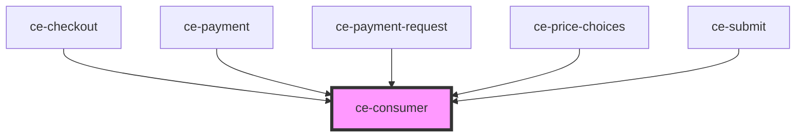

# ce-consumer

<!-- Auto Generated Below -->

## Properties

| Property   | Attribute  | Description | Type  | Default     |
| ---------- | ---------- | ----------- | ----- | ----------- |
| `renderer` | `renderer` |             | `any` | `undefined` |

## Events

| Event           | Description | Type               |
| --------------- | ----------- | ------------------ |
| `mountConsumer` |             | `CustomEvent<any>` |

## Dependencies

### Used by

 - [ce-checkout](../../controllers/checkout)
 - [ce-payment](../../controllers/payment)
 - [ce-payment-request](../../controllers/payment-request)
 - [ce-price-choices](../../controllers/price-chooser)
 - [ce-submit](../../controllers/submit)

### Graph

----------------------------------------------

*Built with [StencilJS](https://stenciljs.com/)*
