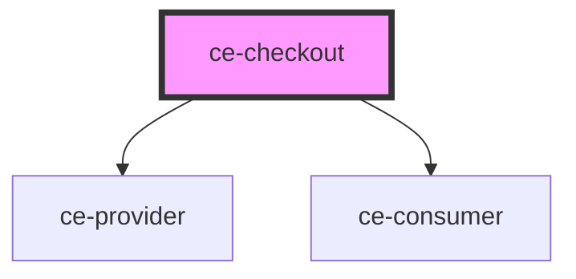

# ce-checkout

<!-- Auto Generated Below -->

## Properties

| Property               | Attribute                | Description | Type       | Default     |
| ---------------------- | ------------------------ | ----------- | ---------- | ----------- |
| `priceIds`             | --                       |             | `string[]` | `undefined` |
| `stripePublishableKey` | `stripe-publishable-key` |             | `string`   | `undefined` |

## Dependencies

### Depends on

- [ce-provider](../../context/provider)
- [ce-consumer](../../context/consumer)

### Graph

----------------------------------------------

*Built with [StencilJS](https://stenciljs.com/)*
