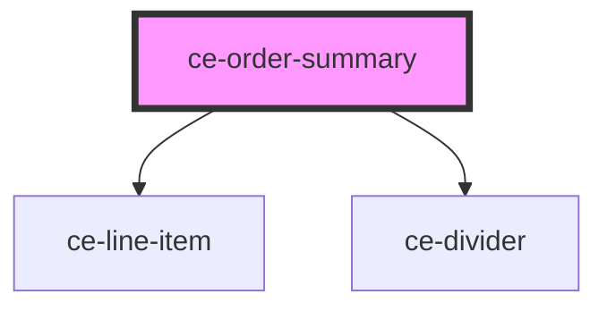

# ce-order-summary

<!-- Auto Generated Below -->

## Properties

| Property       | Attribute       | Description | Type     | Default |
| -------------- | --------------- | ----------- | -------- | ------- |
| `currencyCode` | `currency-code` |             | `string` | `'USD'` |
| `subtotal`     | `subtotal`      |             | `number` | `0`     |
| `total`        | `total`         |             | `number` | `0`     |

## Dependencies

### Depends on

- [ce-line-item](../../ui/line-item)
- [ce-divider](../../ui/divider)

### Graph

----------------------------------------------

*Built with [StencilJS](https://stenciljs.com/)*
