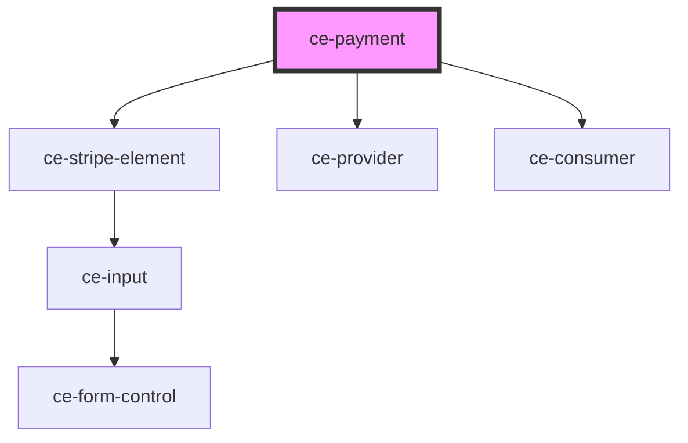

# ce-payment

<!-- Auto Generated Below -->

## Dependencies

### Depends on

- [ce-stripe-element](../../ui/stripe-element)
- [ce-provider](../../context/provider)
- [ce-consumer](../../context/consumer)

### Graph

----------------------------------------------

*Built with [StencilJS](https://stenciljs.com/)*
