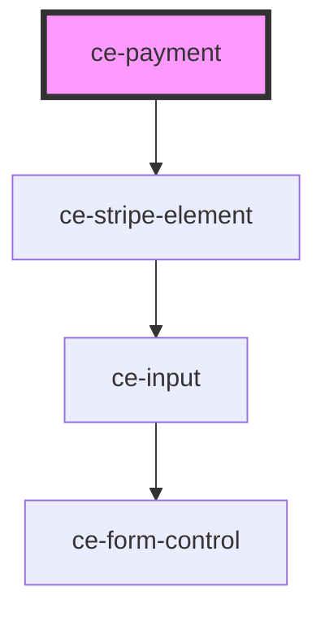

# ce-payment

<!-- Auto Generated Below -->

## Properties

| Property               | Attribute                | Description | Type     | Default     |
| ---------------------- | ------------------------ | ----------- | -------- | ----------- |
| `paymentMethod`        | `payment-method`         |             | `string` | `'stripe'`  |
| `stripePublishableKey` | `stripe-publishable-key` |             | `string` | `undefined` |

## Dependencies

### Depends on

- [ce-stripe-element](../../ui/stripe-element)

### Graph

----------------------------------------------

*Built with [StencilJS](https://stenciljs.com/)*
