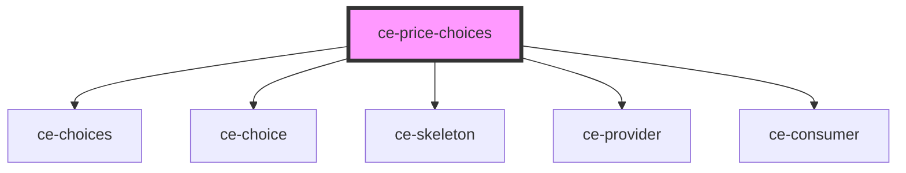

# ce-price-choices

<!-- Auto Generated Below -->

## Properties

| Property     | Attribute    | Description | Type                    | Default     |
| ------------ | ------------ | ----------- | ----------------------- | ----------- |
| `columns`    | `columns`    |             | `number`                | `1`         |
| `default`    | `default`    |             | `string`                | `undefined` |
| `loading`    | `loading`    |             | `boolean`               | `true`      |
| `price_ids`  | --           |             | `string[]`              | `undefined` |
| `prices`     | --           |             | `Price[]`               | `undefined` |
| `submitting` | `submitting` |             | `boolean`               | `true`      |
| `type`       | `type`       |             | `"checkbox" \| "radio"` | `'radio'`   |

## Dependencies

### Depends on

- [ce-choices](../../ui/choices)
- [ce-choice](../../ui/choice)
- [ce-skeleton](../../ui/skeleton)
- [ce-provider](../../context/provider)
- [ce-consumer](../../context/consumer)

### Graph

----------------------------------------------

*Built with [StencilJS](https://stenciljs.com/)*
