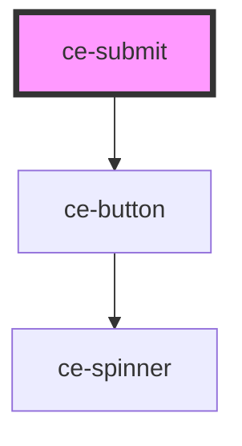

# ce-submit

<!-- Auto Generated Below -->

## Properties

| Property  | Attribute | Description                 | Type                             | Default     |
| --------- | --------- | --------------------------- | -------------------------------- | ----------- |
| `full`    | `full`    | Draws the button full-width | `boolean`                        | `true`      |
| `loading` | `loading` | Is the button loading       | `boolean`                        | `undefined` |
| `size`    | `size`    | The button's size.          | `"large" \| "medium" \| "small"` | `'large'`   |
| `text`    | `text`    | Draws the button full-width | `string`                         | `''`        |

## Dependencies

### Depends on

- [ce-button](../../ui/button)

### Graph

----------------------------------------------

*Built with [StencilJS](https://stenciljs.com/)*
