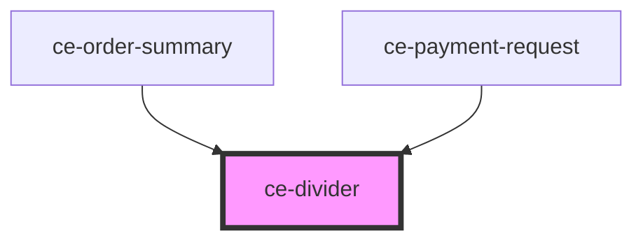

# ce-divider

<!-- Auto Generated Below -->

## Shadow Parts

| Part     | Description |
| -------- | ----------- |
| `"base"` |             |
| `"line"` |             |
| `"text"` |             |

## Dependencies

### Used by

 - [ce-order-summary](../../controllers/order-summary)
 - [ce-payment-request](../../controllers/payment-request)

### Graph

----------------------------------------------

*Built with [StencilJS](https://stenciljs.com/)*
