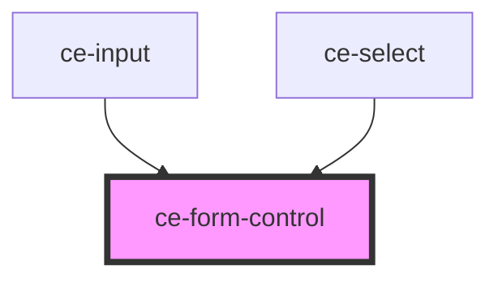

# ce-form-control

<!-- Auto Generated Below -->

## Properties

| Property    | Attribute    | Description | Type                             | Default     |
| ----------- | ------------ | ----------- | -------------------------------- | ----------- |
| `help`      | `help`       |             | `string`                         | `undefined` |
| `helpId`    | `help-id`    |             | `string`                         | `undefined` |
| `inputId`   | `input-id`   |             | `string`                         | `undefined` |
| `label`     | `label`      |             | `string`                         | `undefined` |
| `labelId`   | `label-id`   |             | `string`                         | `undefined` |
| `showLabel` | `show-label` |             | `boolean`                        | `true`      |
| `size`      | `size`       |             | `"large" \| "medium" \| "small"` | `'medium'`  |

## Shadow Parts

| Part             | Description |
| ---------------- | ----------- |
| `"form-control"` |             |
| `"help-text"`    |             |
| `"label"`        |             |

## Dependencies

### Used by

 - [ce-input](../input)
 - [ce-select](../select)

### Graph

----------------------------------------------

*Built with [StencilJS](https://stenciljs.com/)*
