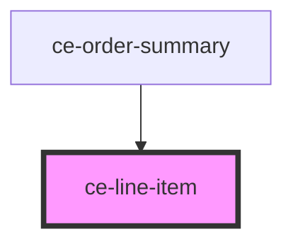

# ce-line-item

<!-- Auto Generated Below -->

## Properties

| Property   | Attribute  | Description       | Type     | Default     |
| ---------- | ---------- | ----------------- | -------- | ----------- |
| `currency` | `currency` | Currency symbol   | `string` | `undefined` |
| `price`    | `price`    | Price of the item | `string` | `undefined` |

## Shadow Parts

| Part      | Description |
| --------- | ----------- |
| `"base"`  |             |
| `"price"` |             |
| `"title"` |             |

## Dependencies

### Used by

 - [ce-order-summary](../../controllers/order-summary)

### Graph

----------------------------------------------

*Built with [StencilJS](https://stenciljs.com/)*
