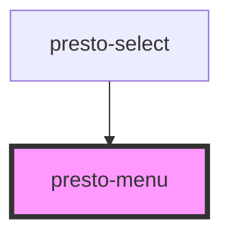

# presto-menu

<!-- Auto Generated Below -->

## Events

| Event          | Description | Type                                                |
| -------------- | ----------- | --------------------------------------------------- |
| `prestoSelect` |             | `CustomEvent<{ item: HTMLPrestoMenuItemElement; }>` |

## Shadow Parts

| Part     | Description |
| -------- | ----------- |
| `"base"` |             |

## Dependencies

### Used by

 - [presto-select](../select)

### Graph

----------------------------------------------

*Built with [StencilJS](https://stenciljs.com/)*
