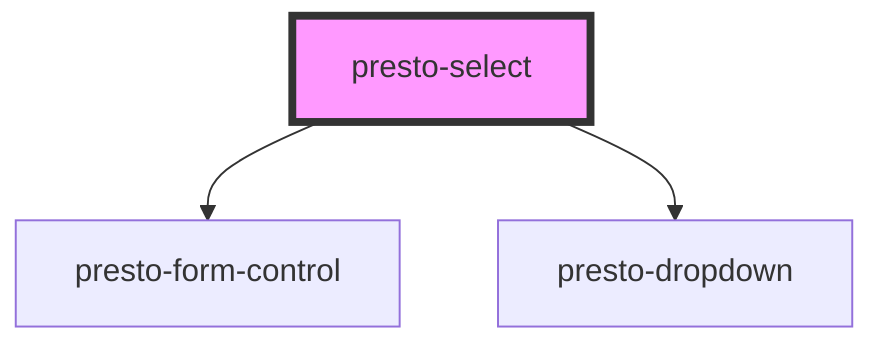

# presto-select

<!-- Auto Generated Below -->

## Properties

| Property         | Attribute          | Description                                                                                                                                                                                    | Type                             | Default     |
| ---------------- | ------------------ | ---------------------------------------------------------------------------------------------------------------------------------------------------------------------------------------------- | -------------------------------- | ----------- |
| `clearable`      | `clearable`        | Adds a clear button when the select is populated.                                                                                                                                              | `boolean`                        | `false`     |
| `disabled`       | `disabled`         | Disables the select control.                                                                                                                                                                   | `boolean`                        | `false`     |
| `help`           | `help`             | The select's help text.                                                                                                                                                                        | `string`                         | `undefined` |
| `invalid`        | `invalid`          | This will be true when the control is in an invalid state. Validity is determined by the `required` prop.                                                                                      | `boolean`                        | `false`     |
| `label`          | `label`            | The select's label. Alternatively, you can use the label slot.                                                                                                                                 | `string`                         | `undefined` |
| `maxTagsVisible` | `max-tags-visible` | The maximum number of tags to show when `multiple` is true. After the maximum, "+n" will be shown to indicate the number of additional items that are selected. Set to -1 to remove the limit. | `number`                         | `3`         |
| `multiple`       | `multiple`         | Enables multiselect. With this enabled, value will be an array.                                                                                                                                | `boolean`                        | `false`     |
| `name`           | `name`             | The select's name.                                                                                                                                                                             | `string`                         | `''`        |
| `pill`           | `pill`             | Draws a pill-style select with rounded edges.                                                                                                                                                  | `boolean`                        | `false`     |
| `placeholder`    | `placeholder`      | The select's placeholder text.                                                                                                                                                                 | `string`                         | `''`        |
| `required`       | `required`         | The select's required attribute.                                                                                                                                                               | `boolean`                        | `false`     |
| `size`           | `size`             | The select's size.                                                                                                                                                                             | `"large" \| "medium" \| "small"` | `'medium'`  |
| `value`          | `value`            | The value of the control. This will be a string or an array depending on `multiple`.                                                                                                           | `string \| string[]`             | `''`        |

## Events

| Event          | Description                                 | Type                |
| -------------- | ------------------------------------------- | ------------------- |
| `prestoBlur`   | Emitted when the control loses focus.       | `CustomEvent<void>` |
| `prestoChange` | Emitted when the control's value changes.   | `CustomEvent<void>` |
| `prestoClear`  | Emitted when the clear button is activated. | `CustomEvent<void>` |
| `prestoFocus`  | Emitted when the control gains focus.       | `CustomEvent<void>` |

## Shadow Parts

| Part     | Description |
| -------- | ----------- |
| `"base"` |             |

## Dependencies

### Depends on

- [presto-form-control](../form-control)
- [presto-dropdown](../dropdown)

### Graph

----------------------------------------------

*Built with [StencilJS](https://stenciljs.com/)*
