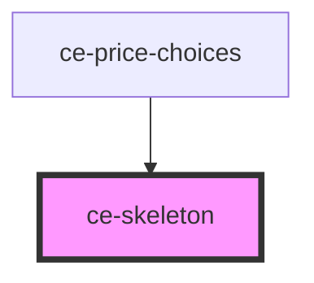

# ce-skeleton

<!-- Auto Generated Below -->

## Properties

| Property | Attribute | Description      | Type                           | Default   |
| -------- | --------- | ---------------- | ------------------------------ | --------- |
| `effect` | `effect`  | Animation effect | `"none" \| "pulse" \| "sheen"` | `'sheen'` |

## Shadow Parts

| Part          | Description |
| ------------- | ----------- |
| `"base"`      |             |
| `"indicator"` |             |

## CSS Custom Properties

| Name              | Description                                                |
| ----------------- | ---------------------------------------------------------- |
| `--border-radius` | The skeleton's border radius.                              |
| `--color`         | The color of the skeleton.                                 |
| `--sheen-color`   | The sheen color when the skeleton is in its loading state. |

## Dependencies

### Used by

 - [ce-price-choices](../../controllers/price-chooser)

### Graph

----------------------------------------------

*Built with [StencilJS](https://stenciljs.com/)*
