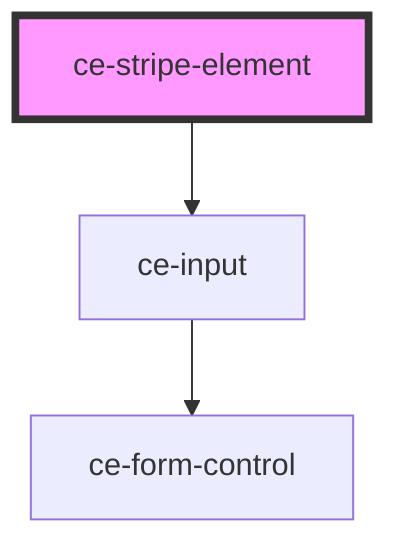

# ce-stripe-element

<!-- Auto Generated Below -->

## Properties

| Property         | Attribute         | Description                                                           | Type                             | Default     |
| ---------------- | ----------------- | --------------------------------------------------------------------- | -------------------------------- | ----------- |
| `hasFocus`       | `has-focus`       | Inputs focus                                                          | `boolean`                        | `undefined` |
| `help`           | `help`            | The input's help text. Alternatively, you can use the help-text slot. | `string`                         | `''`        |
| `label`          | `label`           | The input's label. Alternatively, you can use the label slot.         | `string`                         | `undefined` |
| `publishableKey` | `publishable-key` | Stripe publishable key                                                | `string`                         | `undefined` |
| `showLabel`      | `show-label`      | Should we show the label                                              | `boolean`                        | `true`      |
| `size`           | `size`            | The input's size.                                                     | `"large" \| "medium" \| "small"` | `'medium'`  |

## Dependencies

### Depends on

- [ce-input](../input)

### Graph

----------------------------------------------

*Built with [StencilJS](https://stenciljs.com/)*
