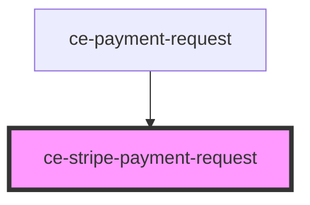

# ce-stripe-payment-request

<!-- Auto Generated Below -->

## Properties

| Property         | Attribute         | Description            | Type     | Default     |
| ---------------- | ----------------- | ---------------------- | -------- | ----------- |
| `amount`         | `amount`          | Amount                 | `number` | `0`         |
| `country`        | `country`         | Country                | `string` | `'US'`      |
| `currency`       | `currency`        | Currency               | `string` | `'usd'`     |
| `label`          | `label`           | Label                  | `string` | `'total'`   |
| `publishableKey` | `publishable-key` | Stripe publishable key | `string` | `undefined` |
| `theme`          | `theme`           | Payment request theme  | `string` | `'dark'`    |

## Shadow Parts

| Part       | Description |
| ---------- | ----------- |
| `"button"` |             |
| `"or"`     |             |

## Dependencies

### Used by

 - [ce-payment-request](../../controllers/payment-request)

### Graph

----------------------------------------------

*Built with [StencilJS](https://stenciljs.com/)*
