# sc-product-buy-page

<!-- Auto Generated Below -->

## Properties

| Property  | Attribute | Description | Type      | Default     |
| --------- | --------- | ----------- | --------- | ----------- |
| `product` | --        |             | `Product` | `undefined` |

## Shadow Parts

| Part     | Description |
| -------- | ----------- |
| `"base"` |             |

## Dependencies

### Depends on

- [sc-checkout](../../checkout-form/checkout)
- [sc-form](../../../ui/form)
- [sc-columns](../../../ui/columns)
- [sc-column](../../../ui/column)
- [sc-input](../../../ui/input)
- [sc-order-submit](../../checkout-form/order-submit)

### Graph

```mermaid
graph TD;
  sc-product-buy-page --> sc-checkout
  sc-product-buy-page --> sc-form
  sc-product-buy-page --> sc-columns
  sc-product-buy-page --> sc-column
  sc-product-buy-page --> sc-input
  sc-product-buy-page --> sc-order-submit
  sc-checkout --> sc-alert
  sc-checkout --> sc-checkout-unsaved-changes-warning
  sc-checkout --> sc-login-provider
  sc-checkout --> sc-form-state-provider
  sc-checkout --> sc-form-error-provider
  sc-checkout --> sc-form-components-validator
  sc-checkout --> sc-order-confirm-provider
  sc-checkout --> sc-session-provider
  sc-checkout --> sc-block-ui
  sc-alert --> sc-icon
  sc-login-provider --> sc-alert
  sc-login-provider --> sc-dialog
  sc-login-provider --> sc-form
  sc-login-provider --> sc-input
  sc-login-provider --> sc-button
  sc-dialog --> sc-button
  sc-dialog --> sc-icon
  sc-button --> sc-spinner
  sc-input --> sc-form-control
  sc-form-control --> sc-tooltip
  sc-form-state-provider --> sc-block-ui
  sc-block-ui --> sc-spinner
  sc-form-error-provider --> sc-checkout-form-errors
  sc-checkout-form-errors --> sc-alert
  sc-form-components-validator --> sc-order-shipping-address
  sc-form-components-validator --> sc-order-tax-id-input
  sc-form-components-validator --> sc-order-bumps
  sc-form-components-validator --> sc-line-item-tax
  sc-order-shipping-address --> sc-address
  sc-order-shipping-address --> sc-compact-address
  sc-address --> sc-form-control
  sc-address --> sc-input
  sc-address --> sc-select
  sc-address --> sc-block-ui
  sc-select --> sc-icon
  sc-select --> sc-menu-label
  sc-select --> sc-menu-item
  sc-select --> sc-form-control
  sc-select --> sc-dropdown
  sc-select --> sc-input
  sc-select --> sc-spinner
  sc-select --> sc-menu
  sc-compact-address --> sc-form-control
  sc-compact-address --> sc-select
  sc-compact-address --> sc-input
  sc-compact-address --> sc-block-ui
  sc-order-tax-id-input --> sc-tax-id-input
  sc-tax-id-input --> sc-icon
  sc-tax-id-input --> sc-input
  sc-tax-id-input --> sc-spinner
  sc-tax-id-input --> sc-dropdown
  sc-tax-id-input --> sc-button
  sc-tax-id-input --> sc-menu
  sc-tax-id-input --> sc-menu-item
  sc-order-bumps --> sc-form-control
  sc-order-bumps --> sc-order-bump
  sc-order-bump --> sc-format-number
  sc-order-bump --> sc-choice
  sc-order-bump --> sc-divider
  sc-line-item-tax --> sc-line-item
  sc-line-item-tax --> sc-format-number
  sc-order-confirm-provider --> sc-dialog
  sc-order-confirm-provider --> sc-icon
  sc-order-confirm-provider --> sc-dashboard-module
  sc-order-confirm-provider --> sc-alert
  sc-order-confirm-provider --> sc-button
  sc-dashboard-module --> sc-alert
  sc-session-provider --> sc-line-items-provider
  sc-order-submit --> sc-paypal-buttons
  sc-order-submit --> sc-button
  sc-order-submit --> sc-icon
  sc-order-submit --> sc-total
  sc-paypal-buttons --> sc-skeleton
  sc-total --> sc-format-number
  style sc-product-buy-page fill:#f9f,stroke:#333,stroke-width:4px
```

----------------------------------------------

*Built with [StencilJS](https://stenciljs.com/)*
