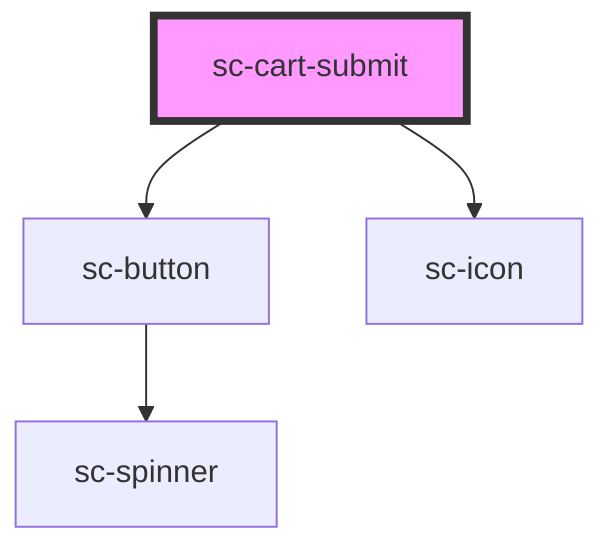

# ce-order-submit

<!-- Auto Generated Below -->

## Properties

| Property | Attribute | Description               | Type                                                                                         | Default     |
| -------- | --------- | ------------------------- | -------------------------------------------------------------------------------------------- | ----------- |
| `busy`   | `busy`    | Is the cart busy          | `boolean`                                                                                    | `undefined` |
| `full`   | `full`    | Show a full-width button. | `boolean`                                                                                    | `true`      |
| `icon`   | `icon`    | Icon to show.             | `string`                                                                                     | `undefined` |
| `size`   | `size`    | The button's size.        | `"large" \| "medium" \| "small"`                                                             | `'medium'`  |
| `type`   | `type`    | The button type.          | `"danger" \| "default" \| "info" \| "link" \| "primary" \| "success" \| "text" \| "warning"` | `'primary'` |

## Dependencies

### Depends on

- [sc-button](../../../ui/button)
- [sc-icon](../../../ui/icon)

### Graph

----------------------------------------------

*Built with [StencilJS](https://stenciljs.com/)*
