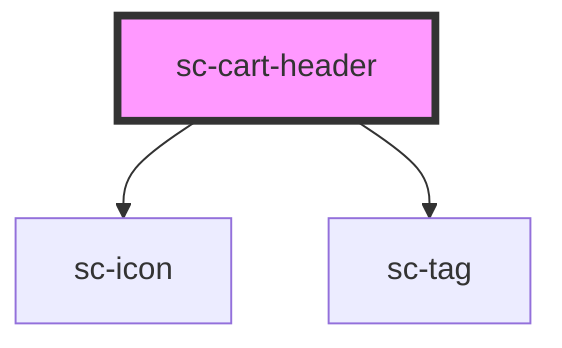

# sc-cart-header

<!-- Auto Generated Below -->

## Properties

| Property | Attribute | Description | Type     | Default     |
| -------- | --------- | ----------- | -------- | ----------- |
| `count`  | `count`   |             | `number` | `undefined` |

## Events

| Event         | Description | Type                |
| ------------- | ----------- | ------------------- |
| `scCloseCart` |             | `CustomEvent<void>` |

## Dependencies

### Depends on

- [sc-icon](../../../ui/icon)
- [sc-tag](../../../ui/tag)

### Graph

----------------------------------------------

*Built with [StencilJS](https://stenciljs.com/)*
