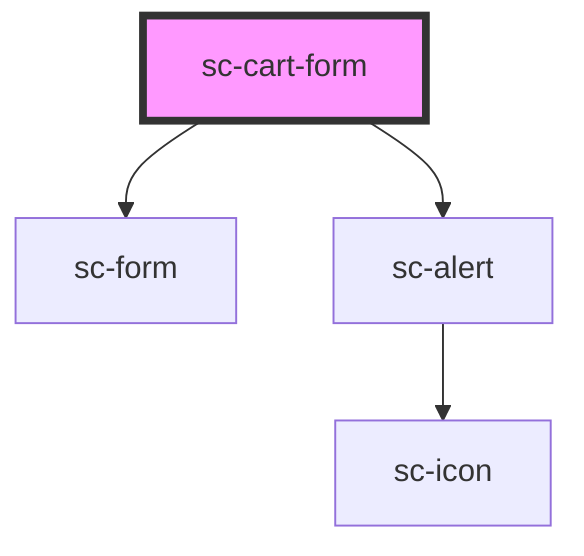

# sc-cart-form

<!-- Auto Generated Below -->

## Properties

| Property   | Attribute  | Description                      | Type               | Default     |
| ---------- | ---------- | -------------------------------- | ------------------ | ----------- |
| `formId`   | `form-id`  | The form id to use for the cart. | `string`           | `undefined` |
| `mode`     | `mode`     | Are we in test or live mode.     | `"live" \| "test"` | `'live'`    |
| `priceId`  | `price-id` | The price id to add.             | `string`           | `undefined` |
| `quantity` | `quantity` | The quantity                     | `number`           | `1`         |

## Dependencies

### Depends on

- [sc-form](../../../ui/form)
- [sc-alert](../../../ui/alert)

### Graph

----------------------------------------------

*Built with [StencilJS](https://stenciljs.com/)*
