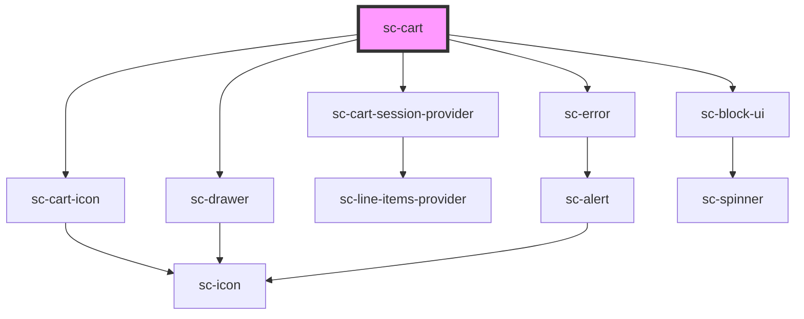

# sc-cart

<!-- Auto Generated Below -->

## Properties

| Property       | Attribute       | Description                                                        | Type               | Default     |
| -------------- | --------------- | ------------------------------------------------------------------ | ------------------ | ----------- |
| `alwaysShow`   | `always-show`   | Should we force show the cart, even if there's a form on the page? | `boolean`          | `undefined` |
| `cartTemplate` | `cart-template` | The template for the cart to inject when opened.                   | `string`           | `undefined` |
| `checkoutLink` | `checkout-link` |                                                                    | `string`           | `undefined` |
| `checkoutUrl`  | `checkout-url`  | The checkout url for the button.                                   | `string`           | `undefined` |
| `formId`       | `form-id`       | The form id to use for the cart.                                   | `string`           | `undefined` |
| `header`       | `header`        | The header for the popout.                                         | `string`           | `undefined` |
| `mode`         | `mode`          | Are we in test or live mode.                                       | `"live" \| "test"` | `'live'`    |

## Dependencies

### Depends on

- [sc-cart-session-provider](../../../providers/cart-session-provider)
- [sc-cart-icon](../../../ui/sc-cart-icon)
- [sc-drawer](../../../ui/sc-drawer)
- [sc-error](../../../ui/error)
- [sc-block-ui](../../../ui/block-ui)

### Graph

----------------------------------------------

*Built with [StencilJS](https://stenciljs.com/)*
