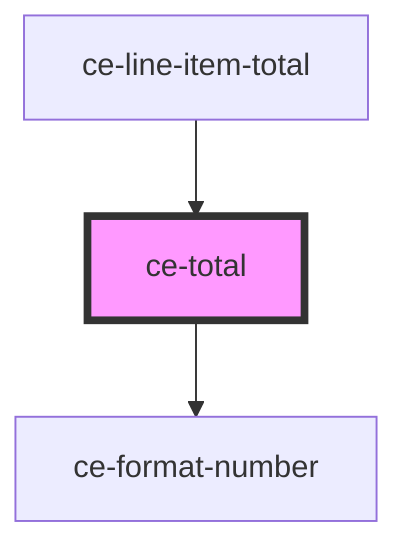

# ce-total

<!-- Auto Generated Below -->

## Properties

| Property          | Attribute | Description | Type                    | Default     |
| ----------------- | --------- | ----------- | ----------------------- | ----------- |
| `checkoutSession` | --        |             | `CheckoutSession`       | `undefined` |
| `total`           | `total`   |             | `"subtotal" \| "total"` | `'total'`   |

## Dependencies

### Used by

 - [ce-line-item-total](../line-item-total)

### Depends on

- [ce-format-number](../../util/format-number)

### Graph

----------------------------------------------

*Built with [StencilJS](https://stenciljs.com/)*
