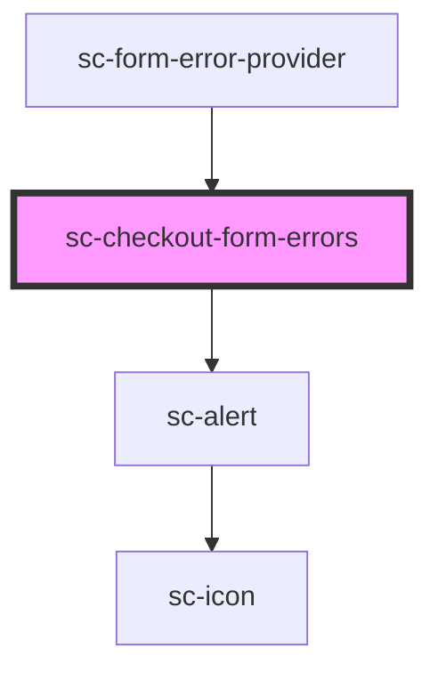

# sc-checkout-form-errors

<!-- Auto Generated Below -->

## Properties

| Property        | Attribute        | Description        | Type                                                                                                                                          | Default     |
| --------------- | ---------------- | ------------------ | --------------------------------------------------------------------------------------------------------------------------------------------- | ----------- |
| `checkoutState` | `checkout-state` | The current order. | `"confirmed" \| "confirming" \| "draft" \| "expired" \| "failure" \| "finalizing" \| "idle" \| "loading" \| "paid" \| "paying" \| "updating"` | `undefined` |
| `error`         | --               | Error to display.  | `ResponseError`                                                                                                                               | `undefined` |

## Dependencies

### Used by

 - [sc-form-error-provider](../../../providers/form-error-provider)

### Depends on

- [sc-alert](../../../ui/alert)

### Graph

----------------------------------------------

*Built with [StencilJS](https://stenciljs.com/)*
