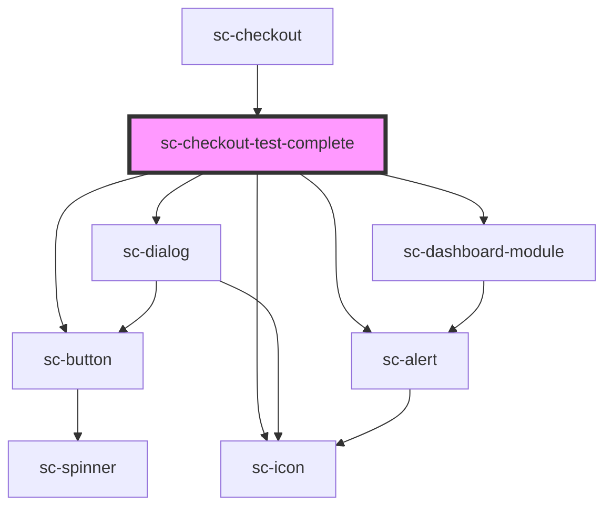

# sc-checkout-test-complete

<!-- Auto Generated Below -->

## Overview

This component listens to the order status
and confirms the order when payment is successful.

## Properties

| Property         | Attribute         | Description                                             | Type     | Default     |
| ---------------- | ----------------- | ------------------------------------------------------- | -------- | ----------- |
| `checkoutStatus` | `checkout-status` | Checkout status to listen and do payment related stuff. | `string` | `undefined` |
| `successUrl`     | `success-url`     | Success url.                                            | `string` | `undefined` |

## Events

| Event         | Description              | Type                    |
| ------------- | ------------------------ | ----------------------- |
| `scOrderPaid` | The order is paid event. | `CustomEvent<Checkout>` |
| `scSetState`  |                          | `CustomEvent<string>`   |

## Dependencies

### Used by

 - [sc-checkout](../checkout)

### Depends on

- [sc-dialog](../../../ui/sc-dialog)
- [sc-icon](../../../ui/icon)
- [sc-dashboard-module](../../../ui/dashboard-module)
- [sc-alert](../../../ui/alert)
- [sc-button](../../../ui/button)

### Graph

----------------------------------------------

*Built with [StencilJS](https://stenciljs.com/)*
