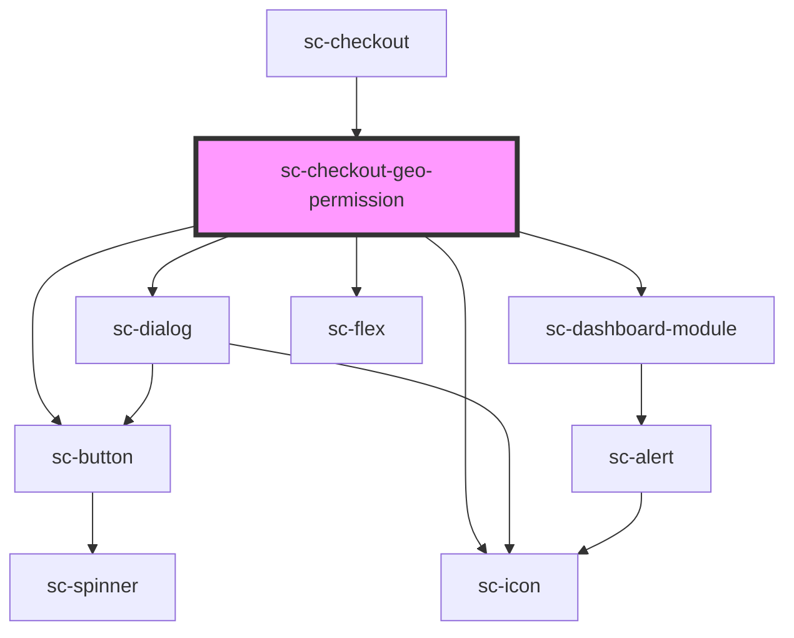

# sc-checkout-geo-permission

<!-- Auto Generated Below -->

## Overview

Explains why location is requested (e.g. regional / purchasing-power-parity pricing) and gates
the browser geolocation prompt behind an explicit opt-in when capture is enabled by the merchant.

## Dependencies

### Used by

 - [sc-checkout](..)

### Depends on

- [sc-dialog](../../../../ui/sc-dialog)
- [sc-dashboard-module](../../../../ui/dashboard-module)
- [sc-flex](../../../../ui/flex)
- [sc-icon](../../../../ui/icon)
- [sc-button](../../../../ui/button)

### Graph

----------------------------------------------

*Built with [StencilJS](https://stenciljs.com/)*
