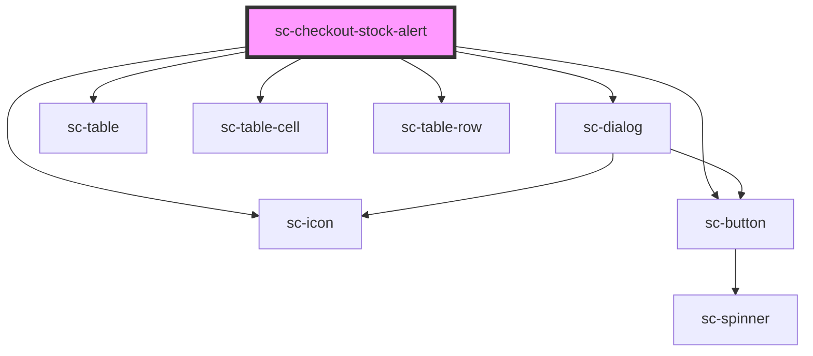

# sc-checkout-stock-alert

<!-- Auto Generated Below -->

## Overview

This component listens for a confirmed event and redirects to the success url.

## Properties

| Property        | Attribute        | Description        | Type                                                                                                                                                           | Default     |
| --------------- | ---------------- | ------------------ | -------------------------------------------------------------------------------------------------------------------------------------------------------------- | ----------- |
| `checkoutState` | `checkout-state` | The current order. | `"confirmed" \| "confirming" \| "draft" \| "expired" \| "failure" \| "finalizing" \| "idle" \| "loading" \| "paid" \| "paying" \| "redirecting" \| "updating"` | `undefined` |
| `error`         | --               | Error to display.  | `ResponseError`                                                                                                                                                | `undefined` |

## Dependencies

### Depends on

- [sc-dialog](../../../../ui/sc-dialog)
- [sc-icon](../../../../ui/icon)
- [sc-table](../../../../ui/table)
- [sc-table-cell](../../../../ui/table-cell)
- [sc-table-row](../../../../ui/table-row)
- [sc-button](../../../../ui/button)

### Graph

----------------------------------------------

*Built with [StencilJS](https://stenciljs.com/)*
