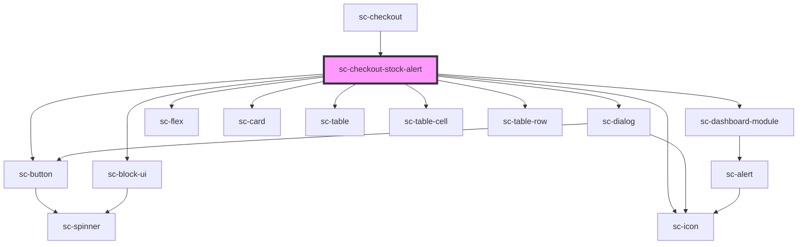

# sc-checkout-stock-alert

<!-- Auto Generated Below -->

## Overview

This component listens for stock requirements and displays a dialog to the user.

## Events

| Event              | Description            | Type                        |
| ------------------ | ---------------------- | --------------------------- |
| `scUpdateLineItem` | Toggle line item event | `CustomEvent<LineItemData>` |

## Dependencies

### Used by

 - [sc-checkout](..)

### Depends on

- [sc-dialog](../../../../ui/sc-dialog)
- [sc-dashboard-module](../../../../ui/dashboard-module)
- [sc-flex](../../../../ui/flex)
- [sc-icon](../../../../ui/icon)
- [sc-card](../../../../ui/card)
- [sc-table](../../../../ui/table)
- [sc-table-cell](../../../../ui/table-cell)
- [sc-table-row](../../../../ui/table-row)
- [sc-button](../../../../ui/button)
- [sc-block-ui](../../../../ui/block-ui)

### Graph

----------------------------------------------

*Built with [StencilJS](https://stenciljs.com/)*
