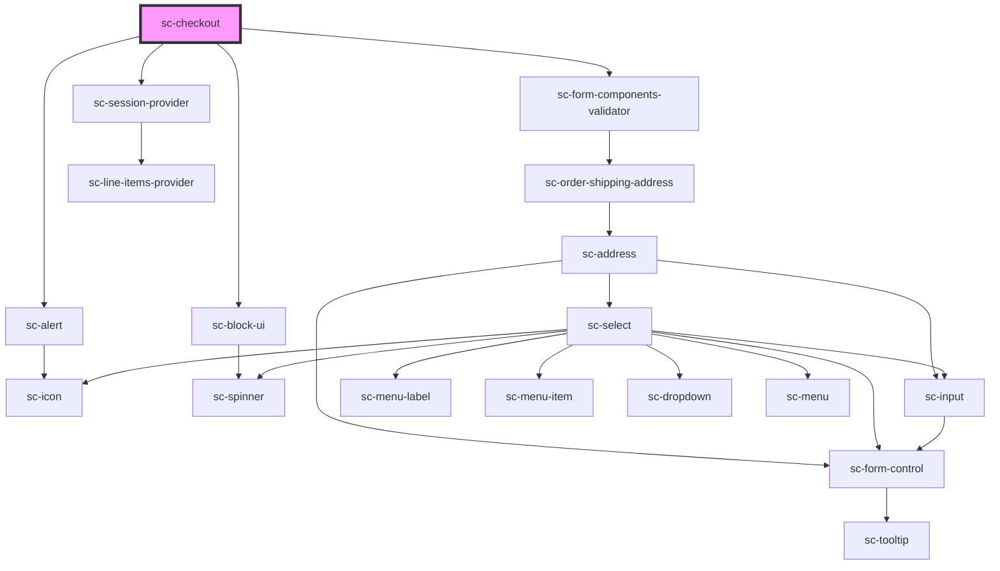

# ce-checkout

<!-- Auto Generated Below -->

## Properties

| Property                      | Attribute                       | Description                                 | Type                           | Default     |
| ----------------------------- | ------------------------------- | ------------------------------------------- | ------------------------------ | ----------- |
| `alignment`                   | `alignment`                     | Alignment                                   | `"center" \| "full" \| "wide"` | `undefined` |
| `coupon`                      | --                              | Optionally pass a coupon.                   | `Coupon`                       | `undefined` |
| `currencyCode`                | `currency-code`                 | Currency to use for this checkout.          | `string`                       | `'usd'`     |
| `customer`                    | --                              | Stores the current customer                 | `Customer`                     | `undefined` |
| `disableComponentsValidation` | `disable-components-validation` | Should we disable components validation     | `boolean`                      | `undefined` |
| `formId`                      | `form-id`                       | The checkout form id                        | `number`                       | `undefined` |
| `loggedIn`                    | `logged-in`                     | Is this user logged in?                     | `boolean`                      | `undefined` |
| `mode`                        | `mode`                          | Are we in test or live mode.                | `"live" \| "test"`             | `'live'`    |
| `modified`                    | `modified`                      | When the form was modified.                 | `string`                       | `undefined` |
| `persistSession`              | `persist-session`               | Where to go on success                      | `boolean`                      | `true`      |
| `prices`                      | --                              | An array of prices to pre-fill in the form. | `PriceChoice[]`                | `[]`        |
| `successUrl`                  | `success-url`                   | Where to go on success                      | `string`                       | `''`        |
| `taxEnabled`                  | `tax-enabled`                   | Is tax enabled?                             | `boolean`                      | `undefined` |

## Dependencies

### Depends on

- [sc-alert](../../../ui/alert)
- [sc-block-ui](../../../ui/block-ui)
- [sc-form-components-validator](../../../providers/form-components-validator)
- [sc-session-provider](../../../providers/session-provider)

### Graph

----------------------------------------------

*Built with [StencilJS](https://stenciljs.com/)*
