# ce-checkout

<!-- Auto Generated Below -->

## Properties

| Property                      | Attribute                       | Description                                                   | Type                           | Default     |
| ----------------------------- | ------------------------------- | ------------------------------------------------------------- | ------------------------------ | ----------- |
| `abandonedCheckoutEnabled`    | `abandoned-checkout-enabled`    | Is abandoned checkout enabled.                                | `boolean`                      | `undefined` |
| `alignment`                   | `alignment`                     | Alignment                                                     | `"center" \| "full" \| "wide"` | `undefined` |
| `currencyCode`                | `currency-code`                 | Currency to use for this checkout.                            | `string`                       | `'usd'`     |
| `customer`                    | --                              | Stores the current customer                                   | `Customer`                     | `undefined` |
| `disableComponentsValidation` | `disable-components-validation` | Should we disable components validation                       | `boolean`                      | `undefined` |
| `editLineItems`               | `edit-line-items`               | Can we edit line items?                                       | `boolean`                      | `true`      |
| `formId`                      | `form-id`                       | The checkout form id                                          | `number`                       | `undefined` |
| `manualPaymentMethods`        | --                              | Manual payment methods enabled for this form.                 | `ManualPaymentMethod[]`        | `undefined` |
| `mode`                        | `mode`                          | Are we in test or live mode.                                  | `"live" \| "test"`             | `'live'`    |
| `modified`                    | `modified`                      | When the form was modified.                                   | `string`                       | `undefined` |
| `persistSession`              | `persist-session`               | Whether to persist the session in the browser between visits. | `boolean`                      | `true`      |
| `prices`                      | --                              | An array of prices to pre-fill in the form.                   | `PriceChoice[]`                | `[]`        |
| `processors`                  | --                              | Processors enabled for this form.                             | `Processor[]`                  | `undefined` |
| `product`                     | --                              | A product to pre-fill the form.                               | `Product`                      | `undefined` |
| `removeLineItems`             | `remove-line-items`             | Can we remove line items?                                     | `boolean`                      | `true`      |
| `stripePaymentElement`        | `stripe-payment-element`        | Use the Stripe payment element.                               | `boolean`                      | `false`     |
| `successUrl`                  | `success-url`                   | Where to go on success                                        | `string`                       | `''`        |
| `taxProtocol`                 | --                              | The account tax protocol                                      | `TaxProtocol`                  | `undefined` |

## Events

| Event              | Description                  | Type                         |
| ------------------ | ---------------------------- | ---------------------------- |
| `scOrderError`     | Checkout has an error.       | `CustomEvent<ResponseError>` |
| `scOrderFinalized` | Checkout has been finalized. | `CustomEvent<Checkout>`      |
| `scOrderUpdated`   | Checkout has been updated.   | `CustomEvent<Checkout>`      |

## Methods

### `submit({ skip_validation }?: { skip_validation: boolean; }) => Promise<Checkout | NodeJS.Timeout | Error>`

Submit the form

#### Parameters

| Name  | Type                            | Description |
| ----- | ------------------------------- | ----------- |
| `__0` | `{ skip_validation: boolean; }` |             |

#### Returns

Type: `Promise<Checkout | Timeout | Error>`

### `validate() => Promise<boolean>`

Validate the form.

#### Returns

Type: `Promise<boolean>`

## Dependencies

### Depends on

- [sc-alert](../../../ui/alert)
- [sc-checkout-unsaved-changes-warning](../../../providers/checkout-unsaved-changes-warning)
- [sc-checkout-stock-alert](checkout-stock-alert)
- [sc-login-provider](../../../providers/sc-login-provider)
- [sc-form-state-provider](../../../providers/form-state-provider)
- [sc-form-error-provider](../../../providers/form-error-provider)
- [sc-form-components-validator](../../../providers/form-components-validator)
- [sc-order-confirm-provider](../../../providers/order-confirm-provider)
- [sc-session-provider](../../../providers/session-provider)
- [sc-block-ui](../../../ui/block-ui)
- [sc-checkout-test-complete](../checkout-test-complete)

### Graph

```mermaid
graph TD;
  sc-checkout --> sc-alert
  sc-checkout --> sc-checkout-unsaved-changes-warning
  sc-checkout --> sc-checkout-stock-alert
  sc-checkout --> sc-login-provider
  sc-checkout --> sc-form-state-provider
  sc-checkout --> sc-form-error-provider
  sc-checkout --> sc-form-components-validator
  sc-checkout --> sc-order-confirm-provider
  sc-checkout --> sc-session-provider
  sc-checkout --> sc-block-ui
  sc-checkout --> sc-checkout-test-complete
  sc-alert --> sc-icon
  sc-checkout-stock-alert --> sc-dialog
  sc-checkout-stock-alert --> sc-dashboard-module
  sc-checkout-stock-alert --> sc-flex
  sc-checkout-stock-alert --> sc-icon
  sc-checkout-stock-alert --> sc-card
  sc-checkout-stock-alert --> sc-table
  sc-checkout-stock-alert --> sc-table-cell
  sc-checkout-stock-alert --> sc-table-row
  sc-checkout-stock-alert --> sc-button
  sc-checkout-stock-alert --> sc-block-ui
  sc-dialog --> sc-button
  sc-dialog --> sc-icon
  sc-button --> sc-spinner
  sc-dashboard-module --> sc-alert
  sc-block-ui --> sc-spinner
  sc-login-provider --> sc-alert
  sc-login-provider --> sc-dialog
  sc-login-provider --> sc-form
  sc-login-provider --> sc-input
  sc-login-provider --> sc-button
  sc-input --> sc-form-control
  sc-form-control --> sc-visually-hidden
  sc-form-state-provider --> sc-block-ui
  sc-form-error-provider --> sc-checkout-form-errors
  sc-checkout-form-errors --> sc-alert
  sc-form-components-validator --> sc-order-shipping-address
  sc-form-components-validator --> sc-order-billing-address
  sc-form-components-validator --> sc-order-tax-id-input
  sc-form-components-validator --> sc-order-bumps
  sc-form-components-validator --> sc-line-item-tax
  sc-form-components-validator --> sc-shipping-choices
  sc-form-components-validator --> sc-line-item-shipping
  sc-form-components-validator --> sc-invoice-details
  sc-form-components-validator --> sc-line-item-invoice-number
  sc-form-components-validator --> sc-line-item-invoice-due-date
  sc-form-components-validator --> sc-line-item-invoice-receipt-download
  sc-form-components-validator --> sc-divider
  sc-form-components-validator --> sc-invoice-memo
  sc-form-components-validator --> sc-line-item-trial
  sc-order-shipping-address --> sc-address
  sc-order-shipping-address --> sc-compact-address
  sc-address --> sc-form-control
  sc-address --> sc-select
  sc-address --> sc-input
  sc-address --> sc-block-ui
  sc-select --> sc-icon
  sc-select --> sc-menu-label
  sc-select --> sc-menu-item
  sc-select --> sc-form-control
  sc-select --> sc-dropdown
  sc-select --> sc-input
  sc-select --> sc-spinner
  sc-select --> sc-menu
  sc-compact-address --> sc-form-control
  sc-compact-address --> sc-select
  sc-compact-address --> sc-input
  sc-compact-address --> sc-block-ui
  sc-order-billing-address --> sc-checkbox
  sc-order-billing-address --> sc-address
  sc-order-tax-id-input --> sc-tax-id-input
  sc-tax-id-input --> sc-icon
  sc-tax-id-input --> sc-input
  sc-tax-id-input --> sc-spinner
  sc-tax-id-input --> sc-dropdown
  sc-tax-id-input --> sc-button
  sc-tax-id-input --> sc-menu
  sc-tax-id-input --> sc-menu-item
  sc-order-bumps --> sc-form-control
  sc-order-bumps --> sc-order-bump
  sc-order-bump --> sc-choice
  sc-order-bump --> sc-divider
  sc-line-item-tax --> sc-line-item
  sc-shipping-choices --> sc-form-control
  sc-shipping-choices --> sc-radio-group
  sc-shipping-choices --> sc-radio
  sc-shipping-choices --> sc-block-ui
  sc-line-item-shipping --> sc-line-item
  sc-line-item-shipping --> sc-skeleton
  sc-line-item-invoice-number --> sc-line-item
  sc-line-item-invoice-number --> sc-skeleton
  sc-line-item-invoice-due-date --> sc-line-item
  sc-line-item-invoice-due-date --> sc-skeleton
  sc-line-item-invoice-receipt-download --> sc-line-item
  sc-line-item-invoice-receipt-download --> sc-skeleton
  sc-line-item-invoice-receipt-download --> sc-icon
  sc-invoice-memo --> sc-skeleton
  sc-line-item-trial --> sc-line-item
  sc-order-confirm-provider --> sc-dialog
  sc-order-confirm-provider --> sc-icon
  sc-order-confirm-provider --> sc-dashboard-module
  sc-order-confirm-provider --> sc-alert
  sc-order-confirm-provider --> sc-button
  sc-session-provider --> sc-line-items-provider
  sc-checkout-test-complete --> sc-dialog
  sc-checkout-test-complete --> sc-icon
  sc-checkout-test-complete --> sc-dashboard-module
  sc-checkout-test-complete --> sc-alert
  sc-checkout-test-complete --> sc-button
  style sc-checkout fill:#f9f,stroke:#333,stroke-width:4px
```

----------------------------------------------

*Built with [StencilJS](https://stenciljs.com/)*
