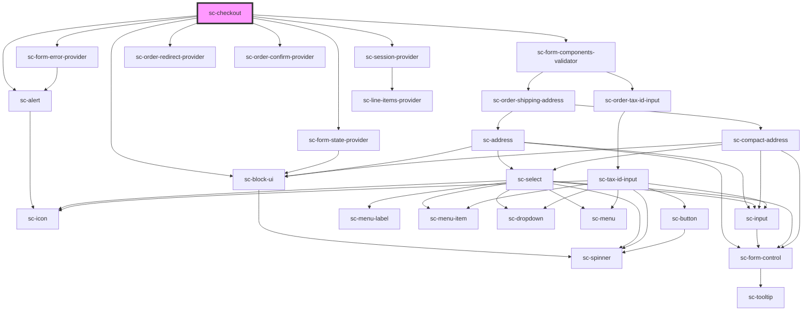

# ce-checkout

<!-- Auto Generated Below -->

## Properties

| Property                      | Attribute                       | Description                                                   | Type                           | Default     |
| ----------------------------- | ------------------------------- | ------------------------------------------------------------- | ------------------------------ | ----------- |
| `alignment`                   | `alignment`                     | Alignment                                                     | `"center" \| "full" \| "wide"` | `undefined` |
| `currencyCode`                | `currency-code`                 | Currency to use for this checkout.                            | `string`                       | `'usd'`     |
| `customer`                    | --                              | Stores the current customer                                   | `Customer`                     | `undefined` |
| `disableComponentsValidation` | `disable-components-validation` | Should we disable components validation                       | `boolean`                      | `undefined` |
| `editLineItems`               | `edit-line-items`               | Can we edit line items?                                       | `boolean`                      | `true`      |
| `formId`                      | `form-id`                       | The checkout form id                                          | `number`                       | `undefined` |
| `loggedIn`                    | `logged-in`                     | Is this user logged in?                                       | `boolean`                      | `undefined` |
| `mode`                        | `mode`                          | Are we in test or live mode.                                  | `"live" \| "test"`             | `'live'`    |
| `modified`                    | `modified`                      | When the form was modified.                                   | `string`                       | `undefined` |
| `persistSession`              | `persist-session`               | Whether to persist the session in the browser between visits. | `boolean`                      | `true`      |
| `prices`                      | --                              | An array of prices to pre-fill in the form.                   | `PriceChoice[]`                | `[]`        |
| `processors`                  | --                              | Processors enabled for this form.                             | `Processor[]`                  | `undefined` |
| `removeLineItems`             | `remove-line-items`             | Can we remove line items?                                     | `boolean`                      | `true`      |
| `stripePaymentElement`        | `stripe-payment-element`        | Use the Stripe payment element.                               | `boolean`                      | `false`     |
| `successUrl`                  | `success-url`                   | Where to go on success                                        | `string`                       | `''`        |
| `taxProtocol`                 | --                              | The account tax protocol                                      | `TaxProtocol`                  | `undefined` |

## Events

| Event              | Description               | Type                         |
| ------------------ | ------------------------- | ---------------------------- |
| `scOrderError`     | Order has an error.       | `CustomEvent<ResponseError>` |
| `scOrderFinalized` | Order has been finalized. | `CustomEvent<Order>`         |
| `scOrderUpdated`   | Order has been updated.   | `CustomEvent<Order>`         |

## Methods

### `submit({ skip_validation }?: { skip_validation: boolean; }) => Promise<any>`

Submit the form

#### Returns

Type: `Promise<any>`

### `validate() => Promise<boolean>`

Validate the form.

#### Returns

Type: `Promise<boolean>`

## Dependencies

### Depends on

- [sc-alert](../../../ui/alert)
- [sc-form-state-provider](../../../providers/form-state-provider)
- [sc-form-error-provider](../../../providers/form-error-provider)
- [sc-form-components-validator](../../../providers/form-components-validator)
- [sc-session-provider](../../../providers/session-provider)
- [sc-order-redirect-provider](../../../providers/order-redirect-provider)
- [sc-order-confirm-provider](../../../providers/order-confirm-provider)
- [sc-block-ui](../../../ui/block-ui)

### Graph

----------------------------------------------

*Built with [StencilJS](https://stenciljs.com/)*
