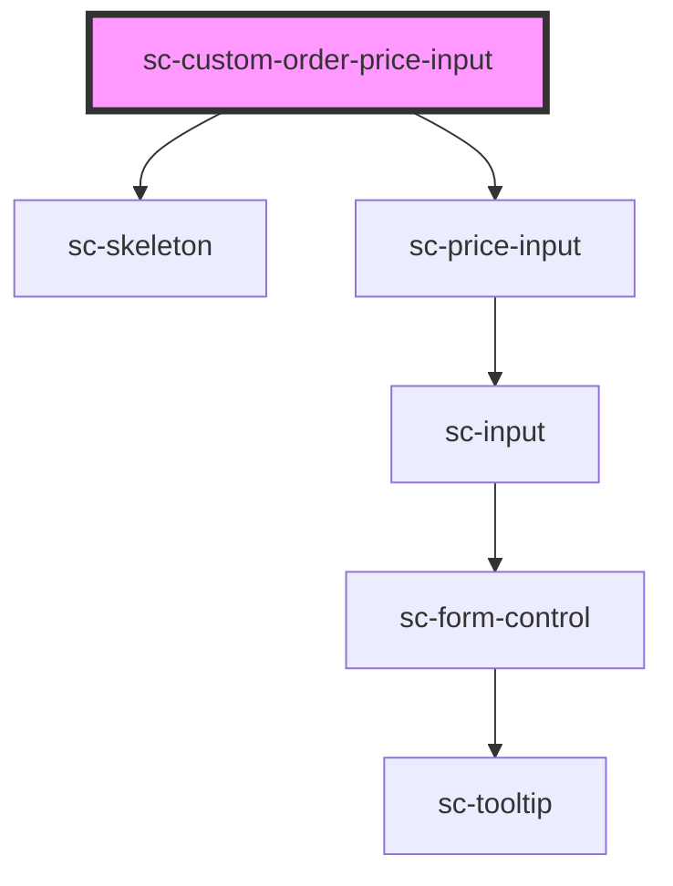

# sc-custom-order-price-input

<!-- Auto Generated Below -->

## Properties

| Property  | Attribute  | Description           | Type      | Default     |
| --------- | ---------- | --------------------- | --------- | ----------- |
| `help`    | `help`     | Help text.            | `string`  | `undefined` |
| `label`   | `label`    | Label for the choice. | `string`  | `undefined` |
| `loading` | `loading`  | Is this loading       | `boolean` | `false`     |
| `price`   | --         | Stores the price      | `Price`   | `undefined` |
| `priceId` | `price-id` | Id of the price.      | `string`  | `undefined` |

## Dependencies

### Depends on

- [sc-skeleton](../../../ui/skeleton)
- [sc-price-input](../../../ui/price-input)

### Graph

----------------------------------------------

*Built with [StencilJS](https://stenciljs.com/)*
