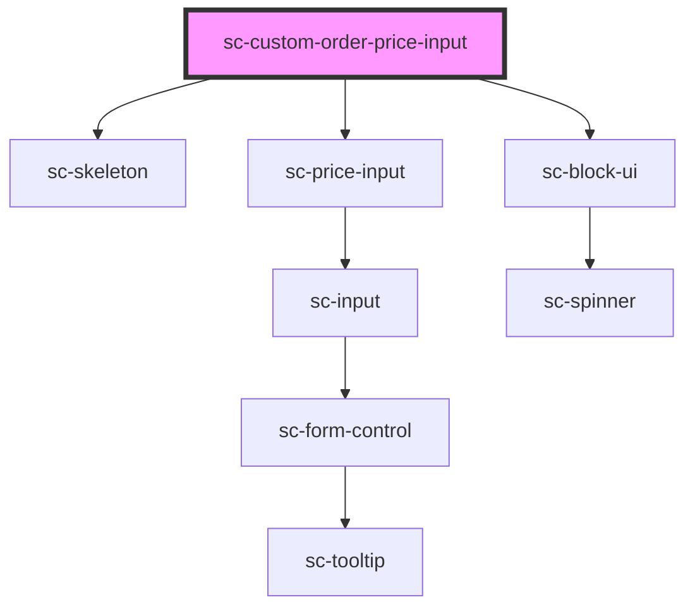

# sc-custom-order-price-input

<!-- Auto Generated Below -->

## Properties

| Property      | Attribute     | Description             | Type         | Default     |
| ------------- | ------------- | ----------------------- | ------------ | ----------- |
| `busy`        | `busy`        | Is this busy            | `boolean`    | `false`     |
| `help`        | `help`        | Help text.              | `string`     | `undefined` |
| `label`       | `label`       | Label for the field.    | `string`     | `undefined` |
| `lineItems`   | --            | Label for the choice.   | `LineItem[]` | `[]`        |
| `loading`     | `loading`     | Is this loading         | `boolean`    | `false`     |
| `placeholder` | `placeholder` | Input placeholder.      | `string`     | `undefined` |
| `price`       | --            | Stores the price        | `Price`      | `undefined` |
| `priceId`     | `price-id`    | Id of the price.        | `string`     | `undefined` |
| `required`    | `required`    | Is this required?       | `boolean`    | `undefined` |
| `showCode`    | `show-code`   | Show the currency code? | `boolean`    | `undefined` |

## Events

| Event              | Description            | Type                        |
| ------------------ | ---------------------- | --------------------------- |
| `scUpdateLineItem` | Toggle line item event | `CustomEvent<LineItemData>` |

## Dependencies

### Depends on

- [sc-skeleton](../../../ui/skeleton)
- [sc-price-input](../../../ui/price-input)
- [sc-block-ui](../../../ui/block-ui)

### Graph

----------------------------------------------

*Built with [StencilJS](https://stenciljs.com/)*
