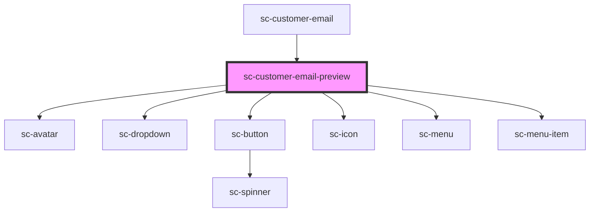

# sc-customer-login

<!-- Auto Generated Below -->

## Dependencies

### Used by

 - [sc-customer-email](../customer-email)

### Depends on

- [sc-avatar](../../../ui/sc-avatar)
- [sc-dropdown](../../../ui/dropdown)
- [sc-button](../../../ui/button)
- [sc-icon](../../../ui/icon)
- [sc-menu](../../../ui/menu)
- [sc-menu-item](../../../ui/menu-item)

### Graph

----------------------------------------------

*Built with [StencilJS](https://stenciljs.com/)*
