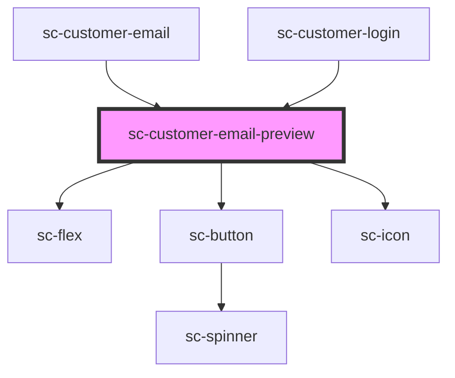

# sc-customer-login

<!-- Auto Generated Below -->

## Dependencies

### Used by

 - [sc-customer-email](../customer-email)
 - [sc-customer-login](../customer-login)

### Depends on

- [sc-flex](../../../ui/flex)
- [sc-button](../../../ui/button)
- [sc-icon](../../../ui/icon)

### Graph

----------------------------------------------

*Built with [StencilJS](https://stenciljs.com/)*
