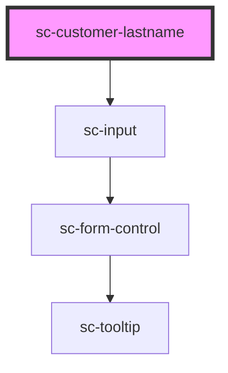

# ce-customer-name

<!-- Auto Generated Below -->

## Properties

| Property      | Attribute     | Description                                                                                                                                                                                                   | Type                             | Default     |
| ------------- | ------------- | ------------------------------------------------------------------------------------------------------------------------------------------------------------------------------------------------------------- | -------------------------------- | ----------- |
| `autofocus`   | `autofocus`   | The input's autofocus attribute.                                                                                                                                                                              | `boolean`                        | `undefined` |
| `customer`    | --            | Force a customer.                                                                                                                                                                                             | `Customer`                       | `undefined` |
| `disabled`    | `disabled`    | Disables the input.                                                                                                                                                                                           | `boolean`                        | `false`     |
| `hasFocus`    | `has-focus`   | Inputs focus                                                                                                                                                                                                  | `boolean`                        | `undefined` |
| `help`        | `help`        | The input's help text.                                                                                                                                                                                        | `string`                         | `''`        |
| `invalid`     | `invalid`     | This will be true when the control is in an invalid state. Validity is determined by props such as `type`, `required`, `minlength`, `maxlength`, and `pattern` using the browser's constraint validation API. | `boolean`                        | `false`     |
| `label`       | `label`       | The input's label.                                                                                                                                                                                            | `string`                         | `undefined` |
| `loggedIn`    | `logged-in`   | Is the user logged in.                                                                                                                                                                                        | `boolean`                        | `undefined` |
| `order`       | --            | (passed from the sc-checkout component automatically)                                                                                                                                                         | `Checkout`                       | `undefined` |
| `pill`        | `pill`        | Draws a pill-style input with rounded edges.                                                                                                                                                                  | `boolean`                        | `false`     |
| `placeholder` | `placeholder` | The input's placeholder text.                                                                                                                                                                                 | `string`                         | `undefined` |
| `readonly`    | `readonly`    | Makes the input readonly.                                                                                                                                                                                     | `boolean`                        | `false`     |
| `required`    | `required`    | Makes the input a required field.                                                                                                                                                                             | `boolean`                        | `false`     |
| `showLabel`   | `show-label`  | Should we show the label                                                                                                                                                                                      | `boolean`                        | `true`      |
| `size`        | `size`        | The input's size.                                                                                                                                                                                             | `"large" \| "medium" \| "small"` | `'medium'`  |
| `value`       | `value`       | The input's value attribute.                                                                                                                                                                                  | `string`                         | `''`        |

## Events

| Event                | Description                                 | Type                                                                                                                                                                                                                                                                                                                                                                                                                                                                                                                                                                                                                                                                                                                                                                                                                                                                                                                                                                                                                                                                                                                                                                                                                                                                                                                                                                                                                                                                                                                                                                                                                                                                                                                                                                        |
| -------------------- | ------------------------------------------- | --------------------------------------------------------------------------------------------------------------------------------------------------------------------------------------------------------------------------------------------------------------------------------------------------------------------------------------------------------------------------------------------------------------------------------------------------------------------------------------------------------------------------------------------------------------------------------------------------------------------------------------------------------------------------------------------------------------------------------------------------------------------------------------------------------------------------------------------------------------------------------------------------------------------------------------------------------------------------------------------------------------------------------------------------------------------------------------------------------------------------------------------------------------------------------------------------------------------------------------------------------------------------------------------------------------------------------------------------------------------------------------------------------------------------------------------------------------------------------------------------------------------------------------------------------------------------------------------------------------------------------------------------------------------------------------------------------------------------------------------------------------------------- |
| `scBlur`             | Emitted when the control loses focus.       | `CustomEvent<void>`                                                                                                                                                                                                                                                                                                                                                                                                                                                                                                                                                                                                                                                                                                                                                                                                                                                                                                                                                                                                                                                                                                                                                                                                                                                                                                                                                                                                                                                                                                                                                                                                                                                                                                                                                         |
| `scChange`           | Emitted when the control's value changes.   | `CustomEvent<void>`                                                                                                                                                                                                                                                                                                                                                                                                                                                                                                                                                                                                                                                                                                                                                                                                                                                                                                                                                                                                                                                                                                                                                                                                                                                                                                                                                                                                                                                                                                                                                                                                                                                                                                                                                         |
| `scClear`            | Emitted when the clear button is activated. | `CustomEvent<void>`                                                                                                                                                                                                                                                                                                                                                                                                                                                                                                                                                                                                                                                                                                                                                                                                                                                                                                                                                                                                                                                                                                                                                                                                                                                                                                                                                                                                                                                                                                                                                                                                                                                                                                                                                         |
| `scFocus`            | Emitted when the control gains focus.       | `CustomEvent<void>`                                                                                                                                                                                                                                                                                                                                                                                                                                                                                                                                                                                                                                                                                                                                                                                                                                                                                                                                                                                                                                                                                                                                                                                                                                                                                                                                                                                                                                                                                                                                                                                                                                                                                                                                                         |
| `scInput`            | Emitted when the control receives input.    | `CustomEvent<void>`                                                                                                                                                                                                                                                                                                                                                                                                                                                                                                                                                                                                                                                                                                                                                                                                                                                                                                                                                                                                                                                                                                                                                                                                                                                                                                                                                                                                                                                                                                                                                                                                                                                                                                                                                         |
| `scUpdateCustomer`   |                                             | `CustomEvent<{ email: string; }>`                                                                                                                                                                                                                                                                                                                                                                                                                                                                                                                                                                                                                                                                                                                                                                                                                                                                                                                                                                                                                                                                                                                                                                                                                                                                                                                                                                                                                                                                                                                                                                                                                                                                                                                                           |
| `scUpdateOrderState` |                                             | `CustomEvent<{ id?: string; status?: "finalized" \| "draft" \| "paid" \| "requires_approval"; staged_payment_intents?: { object: "list"; pagination: Pagination; data: PaymentIntent[]; }; bump_amount?: number; payment_method_required?: boolean; reusable_payment_method_required?: boolean; number?: string; amount_due?: number; trial_amount?: number; charge?: string \| Charge; name?: string; email?: string; live_mode?: boolean; currency?: string; total_amount?: number; subtotal_amount?: number; proration_amount?: number; applied_balance_amount?: number; discounts?: number; tax_amount?: number; tax_inclusive_amount?: number; tax_exclusive_amount?: number; tax_status?: "disabled" \| "address_invalid" \| "estimated" \| "calculated"; tax_label?: string; tax_percent?: number; line_items?: lineItems; recommended_bumps?: { object: "list"; pagination: Pagination; data: Bump[]; }; metadata?: Object; payment_intent?: PaymentIntent; payment_method?: PaymentMethod; order?: string \| Order; customer?: string \| Customer; subscriptions?: { object: "list"; pagination: Pagination; data: Subscription[]; }; purchases?: { object: "list"; pagination: Pagination; data: Purchase[]; }; discount_amount?: number; discount?: DiscountResponse; billing_address?: string \| Address; shipping_address?: string \| Address; shipping_enabled?: boolean; processor_data?: ProcessorData; tax_identifier?: { number: string; number_type: string; }; url?: string; created_at?: number; constructor?: Function; toString?: () => string; toLocaleString?: () => string; valueOf?: () => Object; hasOwnProperty?: (v: PropertyKey) => boolean; isPrototypeOf?: (v: Object) => boolean; propertyIsEnumerable?: (v: PropertyKey) => boolean; }>` |

## Methods

### `reportValidity() => Promise<boolean>`

#### Returns

Type: `Promise<boolean>`

## Dependencies

### Depends on

- [sc-input](../../../ui/input)

### Graph

----------------------------------------------

*Built with [StencilJS](https://stenciljs.com/)*
