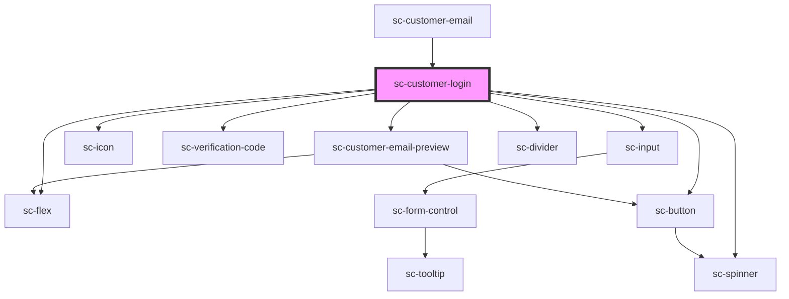

# sc-customer-login

<!-- Auto Generated Below -->

## Properties

| Property    | Attribute    | Description                      | Type     | Default |
| ----------- | ------------ | -------------------------------- | -------- | ------- |
| `codeError` | `code-error` | Code Error comin from the parent | `string` | `''`    |

## Events

| Event                      | Description       | Type                |
| -------------------------- | ----------------- | ------------------- |
| `scClearVerificationCodes` | Clear Codes event | `CustomEvent<void>` |

## Dependencies

### Used by

 - [sc-customer-email](../customer-email)

### Depends on

- [sc-flex](../../../ui/flex)
- [sc-input](../../../ui/input)
- [sc-button](../../../ui/button)
- [sc-icon](../../../ui/icon)
- [sc-verification-code](../../../ui/verification-code)
- [sc-spinner](../../../ui/spinner)
- [sc-customer-email-preview](../customer-email-preview)
- [sc-divider](../../../ui/divider)

### Graph

----------------------------------------------

*Built with [StencilJS](https://stenciljs.com/)*
