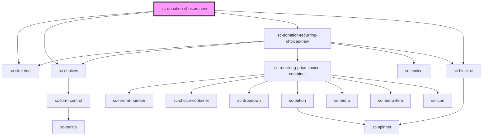

# sc-donation-choices-new

<!-- Auto Generated Below -->

## Properties

| Property          | Attribute        | Description                               | Type       | Default     |
| ----------------- | ---------------- | ----------------------------------------- | ---------- | ----------- |
| `amountcolumns`   | `amountcolumns`  | The label for the field.                  | `number`   | `undefined` |
| `amountlabel`     | `amountlabel`    | The label for the field.                  | `string`   | `undefined` |
| `busy`            | `busy`           |                                           | `boolean`  | `undefined` |
| `currencyCode`    | `currency-code`  | Currency code for the donation.           | `string`   | `'usd'`     |
| `defaultAmount`   | `default-amount` | The default amount to load the page with. | `string`   | `undefined` |
| `lineItem`        | --               | Order line items.                         | `LineItem` | `undefined` |
| `loading`         | `loading`        | Is this loading                           | `boolean`  | `undefined` |
| `priceId`         | `price-id`       | The price id for the fields.              | `string`   | `undefined` |
| `product`         | `product`        | The product id for the fields.            | `string`   | `undefined` |
| `recurringlabel`  | `recurringlabel` | The label for the field.                  | `string`   | `undefined` |
| `selectedProduct` | --               |                                           | `Product`  | `undefined` |

## Events

| Event              | Description            | Type                        |
| ------------------ | ---------------------- | --------------------------- |
| `scToggleLineItem` | Toggle line item event | `CustomEvent<LineItemData>` |

## Dependencies

### Depends on

- [sc-skeleton](../../../ui/skeleton)
- [sc-choices](../../../ui/choices)
- [sc-donation-recurring-choices-new](../donation-recurring-choices-new)
- [sc-block-ui](../../../ui/block-ui)

### Graph

----------------------------------------------

*Built with [StencilJS](https://stenciljs.com/)*
