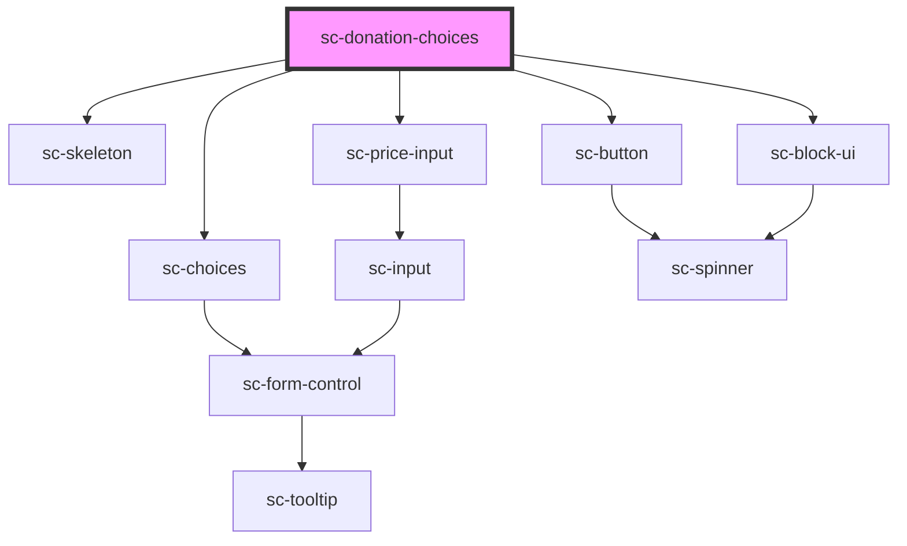

# ce-donation-choices

<!-- Auto Generated Below -->

## Properties

| Property        | Attribute        | Description                               | Type         | Default     |
| --------------- | ---------------- | ----------------------------------------- | ------------ | ----------- |
| `busy`          | `busy`           |                                           | `boolean`    | `undefined` |
| `defaultAmount` | `default-amount` | The default amount to load the page with. | `string`     | `undefined` |
| `label`         | `label`          | The label for the field.                  | `string`     | `undefined` |
| `lineItems`     | --               | Order line items.                         | `LineItem[]` | `[]`        |
| `loading`       | `loading`        | Is this loading                           | `boolean`    | `undefined` |
| `priceId`       | `price-id`       | The price id for the fields.              | `string`     | `undefined` |
| `removeInvalid` | `remove-invalid` |                                           | `boolean`    | `true`      |

## Events

| Event              | Description            | Type                        |
| ------------------ | ---------------------- | --------------------------- |
| `scAddLineItem`    | Toggle line item event | `CustomEvent<LineItemData>` |
| `scRemoveLineItem` | Toggle line item event | `CustomEvent<LineItemData>` |
| `scUpdateLineItem` | Toggle line item event | `CustomEvent<LineItemData>` |

## Methods

### `reportValidity() => Promise<boolean>`

#### Returns

Type: `Promise<boolean>`

## Dependencies

### Depends on

- [sc-skeleton](../../../ui/skeleton)
- [sc-choices](../../../ui/choices)
- [sc-price-input](../../../ui/price-input)
- [sc-button](../../../ui/button)
- [sc-block-ui](../../../ui/block-ui)

### Graph

----------------------------------------------

*Built with [StencilJS](https://stenciljs.com/)*
