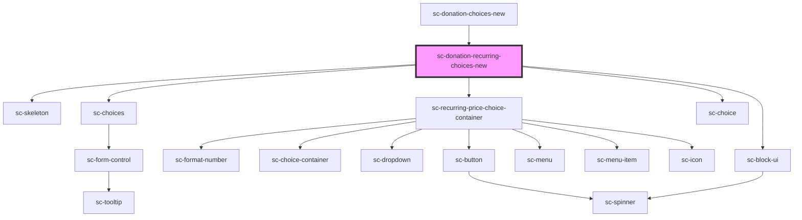

# sc-donation-recurring-choices-new

<!-- Auto Generated Below -->

## Properties

| Property          | Attribute  | Description                    | Type      | Default     |
| ----------------- | ---------- | ------------------------------ | --------- | ----------- |
| `busy`            | `busy`     |                                | `boolean` | `undefined` |
| `label`           | `label`    | The label for the field.       | `string`  | `undefined` |
| `loading`         | `loading`  | Is this loading                | `boolean` | `undefined` |
| `priceId`         | `price-id` | The price id for the fields.   | `string`  | `undefined` |
| `prices`          | --         |                                | `Price[]` | `undefined` |
| `product`         | `product`  | The product id for the fields. | `string`  | `undefined` |
| `selectedProduct` | --         |                                | `Product` | `undefined` |

## Events

| Event              | Description            | Type                             |
| ------------------ | ---------------------- | -------------------------------- |
| `scChange`         |                        | `CustomEvent<boolean \| string>` |
| `scUpdateLineItem` | Toggle line item event | `CustomEvent<LineItemData>`      |

## Dependencies

### Used by

 - [sc-donation-choices-new](../donation-choices-new)

### Depends on

- [sc-skeleton](../../../ui/skeleton)
- [sc-choices](../../../ui/choices)
- [sc-recurring-price-choice-container](../../../ui/sc-recurring-price-choice-container)
- [sc-choice](../../../ui/choice)
- [sc-block-ui](../../../ui/block-ui)

### Graph

----------------------------------------------

*Built with [StencilJS](https://stenciljs.com/)*
