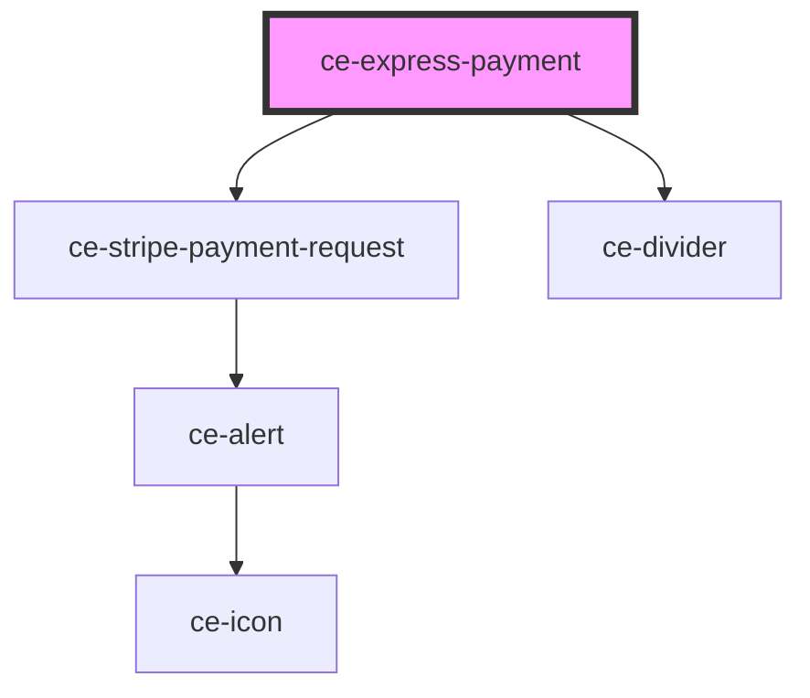

# ce-payment-request

<!-- Auto Generated Below -->

## Properties

| Property      | Attribute      | Description | Type                   | Default     |
| ------------- | -------------- | ----------- | ---------------------- | ----------- |
| `debug`       | `debug`        |             | `boolean`              | `undefined` |
| `dividerText` | `divider-text` |             | `string`               | `undefined` |
| `formId`      | `form-id`      |             | `number \| string`     | `undefined` |
| `order`       | --             |             | `Order`                | `undefined` |
| `processor`   | `processor`    |             | `"paypal" \| "stripe"` | `undefined` |

## Dependencies

### Depends on

- [ce-stripe-payment-request](../../../ui/stripe-payment-request)
- [ce-divider](../../../ui/divider)

### Graph

----------------------------------------------

*Built with [StencilJS](https://stenciljs.com/)*
