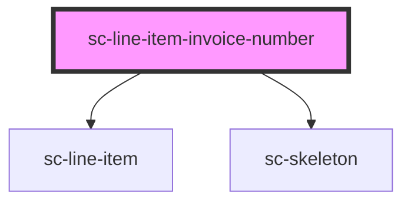

# sc-line-item-invoice-number

<!-- Auto Generated Below -->

## Properties

| Property   | Attribute | Description | Type                  | Default     |
| ---------- | --------- | ----------- | --------------------- | ----------- |
| `checkout` | --        |             | `Checkout`            | `undefined` |
| `size`     | `size`    |             | `"large" \| "medium"` | `undefined` |

## Dependencies

### Depends on

- [sc-line-item](../../../ui/line-item)
- [sc-skeleton](../../../ui/skeleton)

### Graph

----------------------------------------------

*Built with [StencilJS](https://stenciljs.com/)*
