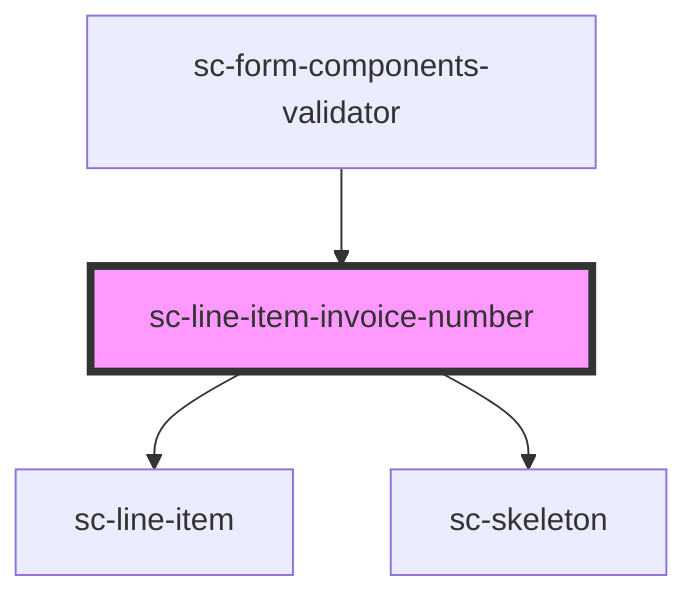

# sc-line-item-invoice-number

<!-- Auto Generated Below -->

## Properties

| Property   | Attribute | Description        | Type       | Default     |
| ---------- | --------- | ------------------ | ---------- | ----------- |
| `checkout` | --        |                    | `Checkout` | `undefined` |
| `number`   | `number`  | The invoice number | `string`   | `undefined` |

## Dependencies

### Used by

 - [sc-form-components-validator](../../../providers/form-components-validator)

### Depends on

- [sc-line-item](../../../ui/line-item)
- [sc-skeleton](../../../ui/skeleton)

### Graph

----------------------------------------------

*Built with [StencilJS](https://stenciljs.com/)*
