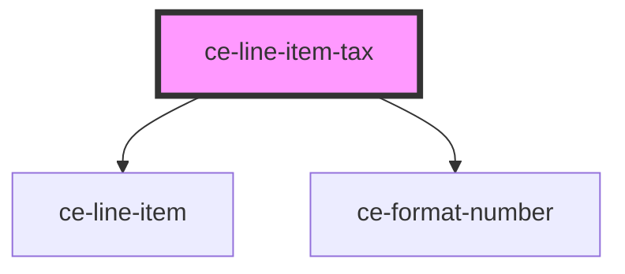

# ce-line-item-tax

<!-- Auto Generated Below -->

## Properties

| Property  | Attribute | Description | Type      | Default     |
| --------- | --------- | ----------- | --------- | ----------- |
| `loading` | `loading` |             | `boolean` | `undefined` |
| `order`   | --        |             | `Order`   | `undefined` |

## Dependencies

### Depends on

- [ce-line-item](../../../ui/line-item)
- [ce-format-number](../../../util/format-number)

### Graph

----------------------------------------------

*Built with [StencilJS](https://stenciljs.com/)*
