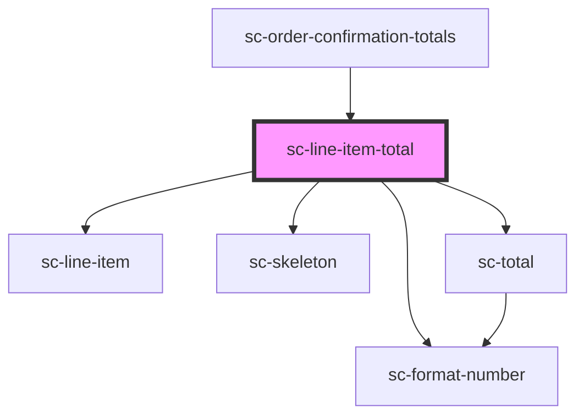

# ce-line-item-total

<!-- Auto Generated Below -->

## Properties

| Property  | Attribute | Description | Type                    | Default     |
| --------- | --------- | ----------- | ----------------------- | ----------- |
| `loading` | `loading` |             | `boolean`               | `undefined` |
| `order`   | --        |             | `Checkout`              | `undefined` |
| `size`    | `size`    |             | `"large" \| "medium"`   | `undefined` |
| `total`   | `total`   |             | `"subtotal" \| "total"` | `'total'`   |

## Dependencies

### Used by

 - [sc-order-confirmation-totals](../../confirmation/order-confirmation-totals)

### Depends on

- [sc-line-item](../../../ui/line-item)
- [sc-skeleton](../../../ui/skeleton)
- [sc-total](../total)
- [sc-format-number](../../../util/format-number)

### Graph

----------------------------------------------

*Built with [StencilJS](https://stenciljs.com/)*
