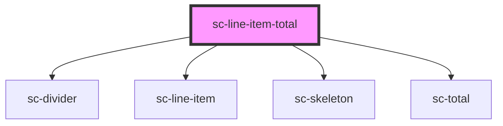

# ce-line-item-total

<!-- Auto Generated Below -->

## Properties

| Property   | Attribute | Description | Type                    | Default     |
| ---------- | --------- | ----------- | ----------------------- | ----------- |
| `checkout` | --        |             | `Checkout`              | `undefined` |
| `size`     | `size`    |             | `"large" \| "medium"`   | `undefined` |
| `total`    | `total`   |             | `"subtotal" \| "total"` | `'total'`   |

## Dependencies

### Depends on

- [sc-divider](../../../ui/divider)
- [sc-line-item](../../../ui/line-item)
- [sc-skeleton](../../../ui/skeleton)
- [sc-total](../total)

### Graph

----------------------------------------------

*Built with [StencilJS](https://stenciljs.com/)*
