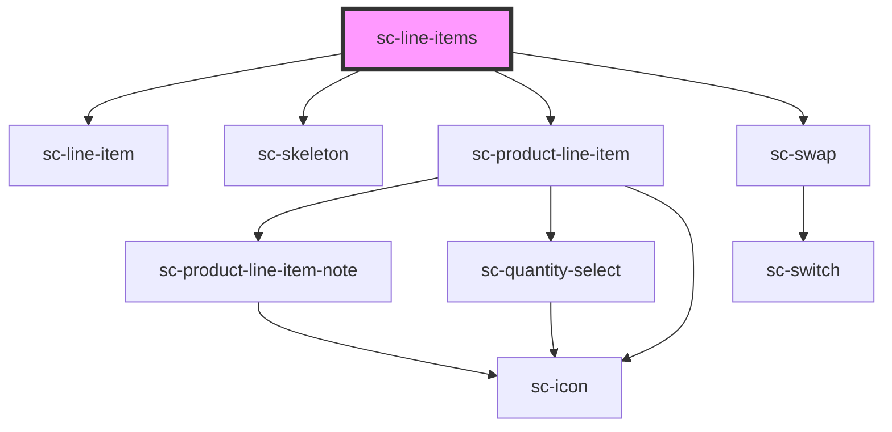

# ce-line-items

<!-- Auto Generated Below -->

## Properties

| Property    | Attribute   | Description                 | Type      | Default     |
| ----------- | ----------- | --------------------------- | --------- | ----------- |
| `editable`  | `editable`  | Is the line item editable?  | `boolean` | `undefined` |
| `removable` | `removable` | Is the line item removable? | `boolean` | `undefined` |

## Shadow Parts

| Part                               | Description                       |
| ---------------------------------- | --------------------------------- |
| `"base"`                           | The component base                |
| `"line-item"`                      | The line item                     |
| `"line-item__image"`               | The line item image               |
| `"line-item__price"`               | The line item price               |
| `"line-item__price-amount"`        | The line item price amount        |
| `"line-item__price-description"`   | The line item price description   |
| `"line-item__price-scratch"`       | The line item price scratch       |
| `"line-item__quantity"`            | The line item quantity            |
| `"line-item__quantity-input"`      | The line item quantity input      |
| `"line-item__quantity-minus"`      | The line item quantity minus      |
| `"line-item__quantity-minus-icon"` | The line item quantity minus icon |
| `"line-item__quantity-plus"`       | The line item quantity plus       |
| `"line-item__quantity-plus-icon"`  | The line item quantity plus icon  |
| `"line-item__remove-icon"`         | The line item remove icon         |
| `"line-item__static-quantity"`     | The line item static quantity     |
| `"line-item__suffix"`              | The line item suffix              |
| `"line-item__text"`                | The line item text                |
| `"line-item__title"`               | The line item title               |
| `"product-line-item"`              | The product line item             |

## Dependencies

### Depends on

- [sc-line-item](../../../ui/line-item)
- [sc-skeleton](../../../ui/skeleton)
- [sc-product-line-item](../../../ui/product-line-item)
- [sc-swap](../sc-swap)

### Graph

----------------------------------------------

*Built with [StencilJS](https://stenciljs.com/)*
