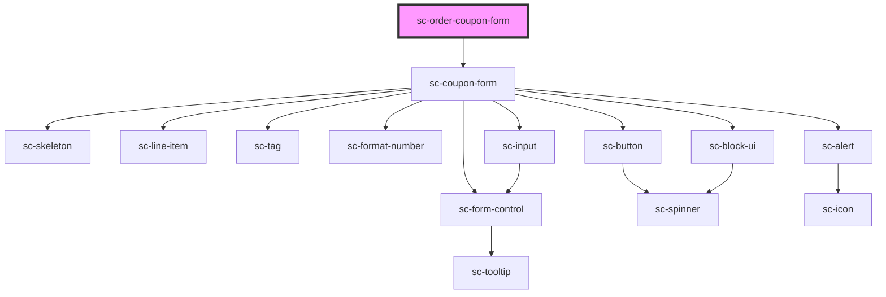

# ce-coupon-form

<!-- Auto Generated Below -->

## Properties

| Property      | Attribute     | Description | Type       | Default     |
| ------------- | ------------- | ----------- | ---------- | ----------- |
| `busy`        | `busy`        |             | `boolean`  | `undefined` |
| `buttonText`  | `button-text` |             | `string`   | `undefined` |
| `collapsed`   | `collapsed`   |             | `boolean`  | `undefined` |
| `error`       | `error`       |             | `any`      | `undefined` |
| `label`       | `label`       |             | `string`   | `undefined` |
| `loading`     | `loading`     |             | `boolean`  | `undefined` |
| `order`       | --            |             | `Checkout` | `undefined` |
| `placeholder` | `placeholder` |             | `string`   | `undefined` |

## Events

| Event           | Description | Type                  |
| --------------- | ----------- | --------------------- |
| `scApplyCoupon` |             | `CustomEvent<string>` |

## Dependencies

### Depends on

- [sc-coupon-form](../../../ui/coupon-form)

### Graph

----------------------------------------------

*Built with [StencilJS](https://stenciljs.com/)*
