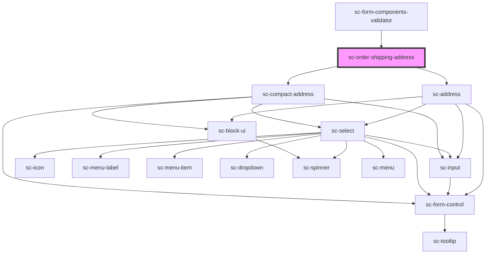

# ce-order-shipping-address

<!-- Auto Generated Below -->

## Properties

| Property                  | Attribute          | Description                           | Type                                                                                                                                          | Default     |
| ------------------------- | ------------------ | ------------------------------------- | --------------------------------------------------------------------------------------------------------------------------------------------- | ----------- |
| `customerShippingAddress` | --                 | Holds the customer's shipping address | `Address`                                                                                                                                     | `undefined` |
| `full`                    | `full`             | Show the full address                 | `boolean`                                                                                                                                     | `undefined` |
| `label`                   | `label`            | Label for the field.                  | `string`                                                                                                                                      | `undefined` |
| `loading`                 | `loading`          | Is this loading.                      | `boolean`                                                                                                                                     | `undefined` |
| `required`                | `required`         | Is this required (defaults to true)   | `boolean`                                                                                                                                     | `true`      |
| `shippingAddress`         | --                 | Holds the customer's billing address  | `Address`                                                                                                                                     | `undefined` |
| `shippingEnabled`         | `shipping-enabled` | Is shipping enabled for this order?   | `boolean`                                                                                                                                     | `undefined` |
| `taxStatus`               | `tax-status`       | Tax status of the order               | `"address_invalid" \| "calculated" \| "disabled" \| "estimated" \| "reverse_charged" \| "tax_registration_not_found" \| "tax_zone_not_found"` | `undefined` |

## Events

| Event           | Description                         | Type                                                                      |
| --------------- | ----------------------------------- | ------------------------------------------------------------------------- |
| `scUpdateOrder` | Make a request to update the order. | `CustomEvent<{ data: Partial<Order>; options?: { silent?: boolean; }; }>` |

## Dependencies

### Used by

 - [sc-form-components-validator](../../../providers/form-components-validator)

### Depends on

- [sc-address](../../../ui/address)
- [sc-compact-address](../../../ui/sc-compact-address)

### Graph

----------------------------------------------

*Built with [StencilJS](https://stenciljs.com/)*
