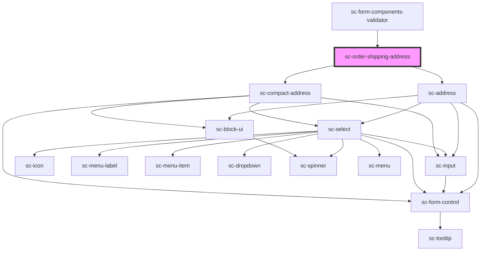

# ce-order-shipping-address

<!-- Auto Generated Below -->

## Properties

| Property                | Attribute                 | Description                          | Type                                                                                                                                                                                                                                                                                                                                                                            | Default                                                                                                                                                                                                                                                                                                                          |
| ----------------------- | ------------------------- | ------------------------------------ | ------------------------------------------------------------------------------------------------------------------------------------------------------------------------------------------------------------------------------------------------------------------------------------------------------------------------------------------------------------------------------- | -------------------------------------------------------------------------------------------------------------------------------------------------------------------------------------------------------------------------------------------------------------------------------------------------------------------------------- |
| `cityPlaceholder`       | `city-placeholder`        |                                      | `string`                                                                                                                                                                                                                                                                                                                                                                        | `__('City', 'surecart')`                                                                                                                                                                                                                                                                                                         |
| `countryPlaceholder`    | `country-placeholder`     |                                      | `string`                                                                                                                                                                                                                                                                                                                                                                        | `__('Country', 'surecart')`                                                                                                                                                                                                                                                                                                      |
| `defaultCountry`        | `default-country`         | Default country for address          | `string`                                                                                                                                                                                                                                                                                                                                                                        | `undefined`                                                                                                                                                                                                                                                                                                                      |
| `full`                  | `full`                    | Show the full address                | `boolean`                                                                                                                                                                                                                                                                                                                                                                       | `undefined`                                                                                                                                                                                                                                                                                                                      |
| `label`                 | `label`                   | Label for the field.                 | `string`                                                                                                                                                                                                                                                                                                                                                                        | `undefined`                                                                                                                                                                                                                                                                                                                      |
| `line1Placeholder`      | `line-1-placeholder`      |                                      | `string`                                                                                                                                                                                                                                                                                                                                                                        | `__('Address', 'surecart')`                                                                                                                                                                                                                                                                                                      |
| `line2Placeholder`      | `line-2-placeholder`      |                                      | `string`                                                                                                                                                                                                                                                                                                                                                                        | `__('Address Line 2', 'surecart')`                                                                                                                                                                                                                                                                                               |
| `loading`               | `loading`                 | Is this loading.                     | `boolean`                                                                                                                                                                                                                                                                                                                                                                       | `undefined`                                                                                                                                                                                                                                                                                                                      |
| `namePlaceholder`       | `name-placeholder`        | Show the placeholder fields.         | `string`                                                                                                                                                                                                                                                                                                                                                                        | `__('Name or Company Name', 'surecart')`                                                                                                                                                                                                                                                                                         |
| `placeholders`          | --                        | Placeholder values.                  | `{ name?: string; line_1?: string; line_2?: string; city?: string; state?: string; postal_code?: string; country?: string; constructor?: Function; toString?: () => string; toLocaleString?: () => string; valueOf?: () => Object; hasOwnProperty?: (v: PropertyKey) => boolean; isPrototypeOf?: (v: Object) => boolean; propertyIsEnumerable?: (v: PropertyKey) => boolean; }` | `{     name: __('Name or Company Name', 'surecart'),     country: __('Country', 'surecart'),     city: __('City', 'surecart'),     line_1: __('Address', 'surecart'),     line_2: __('Address Line 2', 'surecart'),     postal_code: __('Postal Code/Zip', 'surecart'),     state: __('State/Province/Region', 'surecart'),   }` |
| `postalCodePlaceholder` | `postal-code-placeholder` |                                      | `string`                                                                                                                                                                                                                                                                                                                                                                        | `__('Postal Code/Zip', 'surecart')`                                                                                                                                                                                                                                                                                              |
| `required`              | `required`                | Is this required (defaults to true)  | `boolean`                                                                                                                                                                                                                                                                                                                                                                       | `true`                                                                                                                                                                                                                                                                                                                           |
| `shippingAddress`       | --                        | Holds the customer's billing address | `Address`                                                                                                                                                                                                                                                                                                                                                                       | `undefined`                                                                                                                                                                                                                                                                                                                      |
| `shippingEnabled`       | `shipping-enabled`        | Is shipping enabled for this order?  | `boolean`                                                                                                                                                                                                                                                                                                                                                                       | `undefined`                                                                                                                                                                                                                                                                                                                      |
| `showName`              | `show-name`               | Show the name field.                 | `boolean`                                                                                                                                                                                                                                                                                                                                                                       | `undefined`                                                                                                                                                                                                                                                                                                                      |
| `statePlaceholder`      | `state-placeholder`       |                                      | `string`                                                                                                                                                                                                                                                                                                                                                                        | `__('State/Province/Region', 'surecart')`                                                                                                                                                                                                                                                                                        |
| `taxStatus`             | `tax-status`              | Tax status of the order              | `"address_invalid" \| "calculated" \| "disabled" \| "estimated" \| "reverse_charged" \| "tax_registration_not_found" \| "tax_zone_not_found"`                                                                                                                                                                                                                                   | `undefined`                                                                                                                                                                                                                                                                                                                      |

## Events

| Event           | Description                         | Type                                                                         |
| --------------- | ----------------------------------- | ---------------------------------------------------------------------------- |
| `scUpdateOrder` | Make a request to update the order. | `CustomEvent<{ data: Partial<Checkout>; options?: { silent?: boolean; }; }>` |

## Methods

### `reportValidity() => Promise<boolean>`

#### Returns

Type: `Promise<boolean>`

## Dependencies

### Used by

 - [sc-form-components-validator](../../../providers/form-components-validator)

### Depends on

- [sc-address](../../../ui/address)
- [sc-compact-address](../../../ui/sc-compact-address)

### Graph

----------------------------------------------

*Built with [StencilJS](https://stenciljs.com/)*
