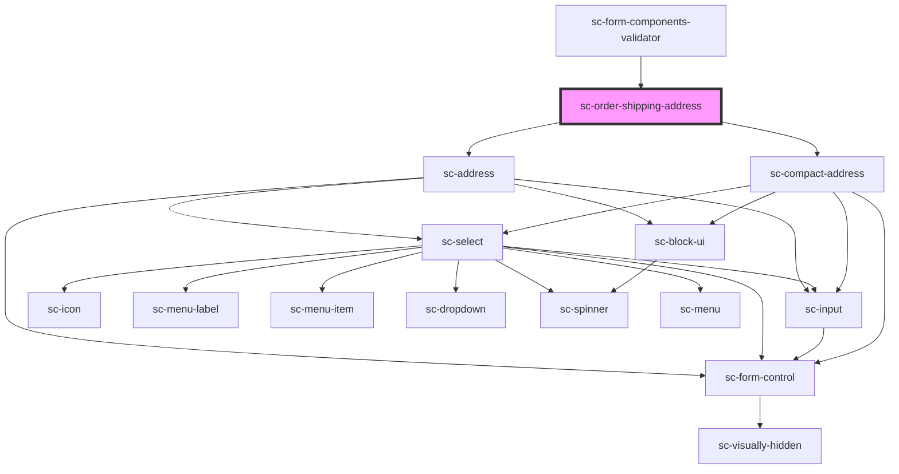

# ce-order-shipping-address

<!-- Auto Generated Below -->

## Properties

| Property         | Attribute         | Description                                | Type      | Default     |
| ---------------- | ----------------- | ------------------------------------------ | --------- | ----------- |
| `defaultCountry` | `default-country` | Default country for address                | `string`  | `undefined` |
| `full`           | `full`            | Show the address                           | `boolean` | `undefined` |
| `label`          | `label`           | Label for the field.                       | `string`  | `undefined` |
| `requireName`    | `require-name`    | Whether to require the name in the address | `boolean` | `false`     |
| `required`       | `required`        | Is this required (defaults to false)       | `boolean` | `false`     |
| `showLine2`      | `show-line-2`     | Show the line 2 field.                     | `boolean` | `undefined` |
| `showName`       | `show-name`       | Show the name field.                       | `boolean` | `undefined` |

## Methods

### `reportValidity() => Promise<boolean>`

#### Returns

Type: `Promise<boolean>`

## Dependencies

### Used by

 - [sc-form-components-validator](../../../providers/form-components-validator)

### Depends on

- [sc-address](../../../ui/address)
- [sc-compact-address](../../../ui/sc-compact-address)

### Graph

----------------------------------------------

*Built with [StencilJS](https://stenciljs.com/)*
